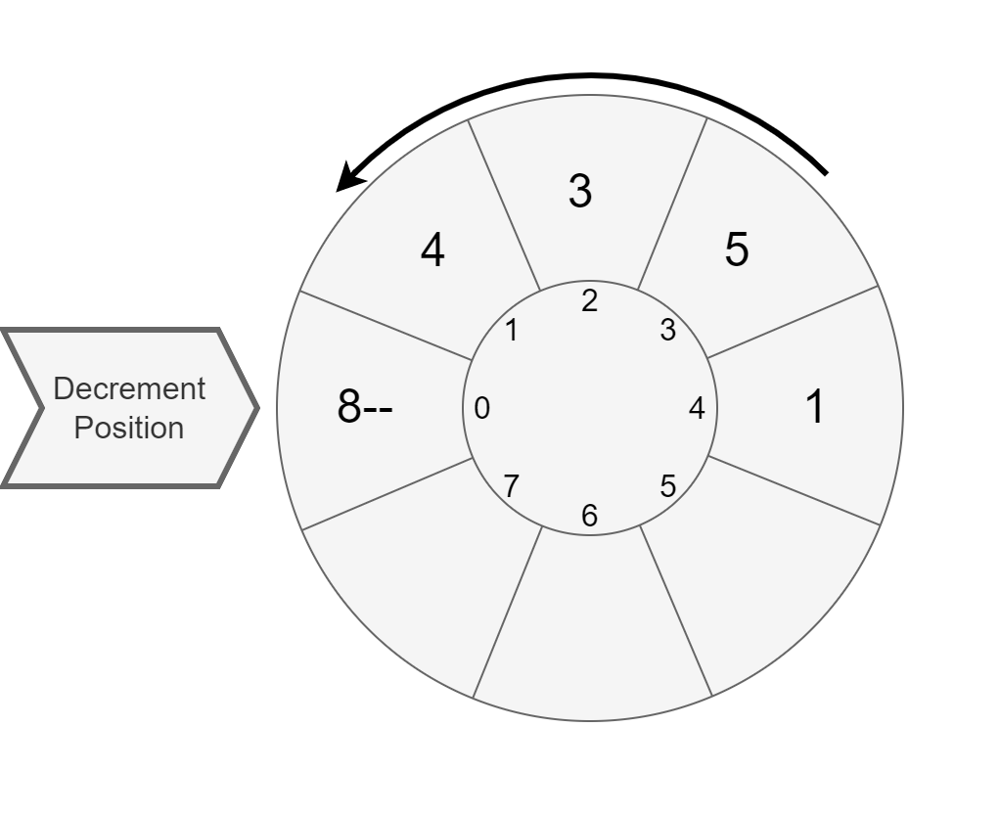
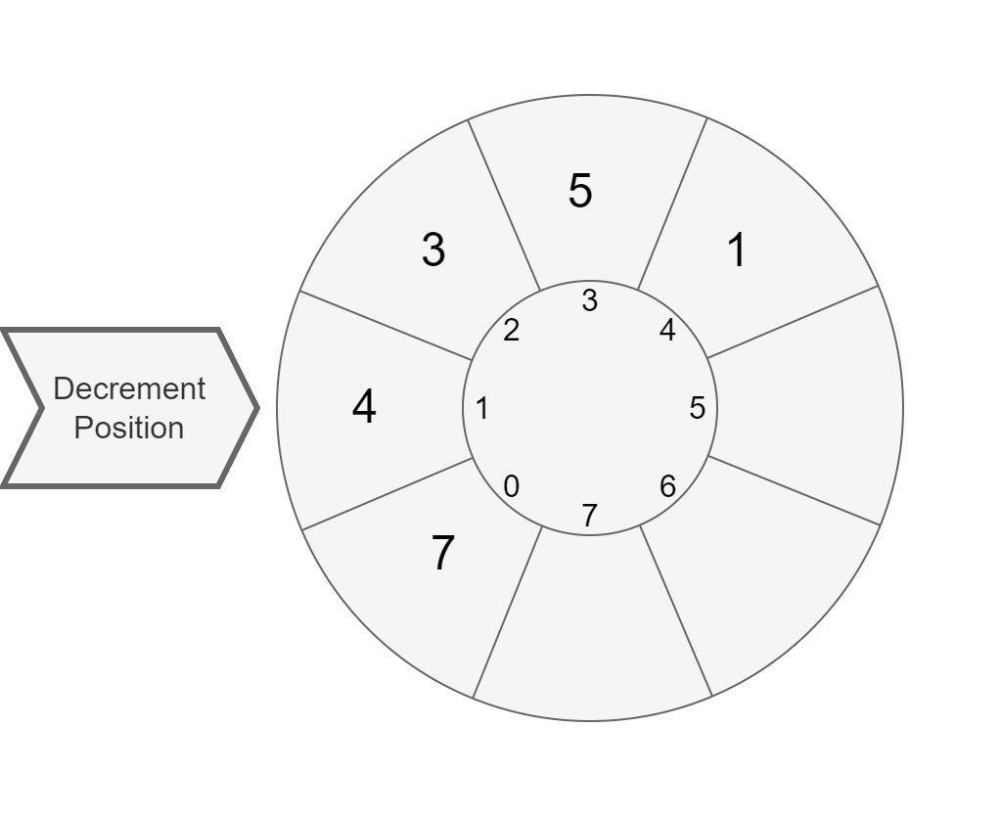
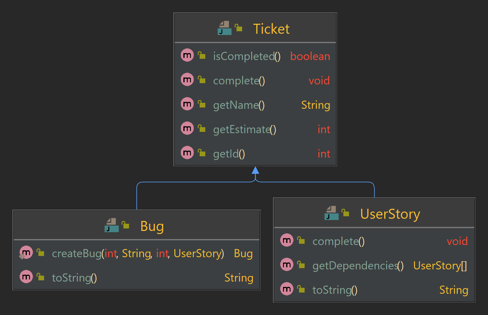
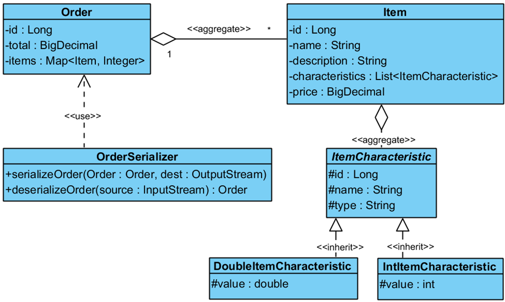

# Java Programming Tasks

This document contains descriptions of various problems for practicing Java programming. Each problem is accompanied by a link to the corresponding class in which it can be solved and detailed instructions.

---

## First Programs in Java

### [Meet Autocode](https://github.com/denys-taranenko/learn-java-basic-epam/tree/main/LearnJavaBasics/src/main/java/com/epam/java/basics/module_1_first_programs_in_java/task_1_meet_autocode)
<details>
  <summary>Task</summary>

The purpose of this exercise is to make you familiar with the Autocode platform.
Estimated workload of this exercise is _5 minutes_.

### Description
Please, proceed to `HelloAutocode` class
and write a simple program that prints "Hello, Autocode!" (don't print quote marks).
</details>

### [Meet a Stranger](https://github.com/denys-taranenko/learn-java-basic-epam/tree/main/LearnJavaBasics/src/main/java/com/epam/java/basics/module_1_first_programs_in_java/task_2_meet_a_stranger)
<details>
  <summary>Task</summary>

The purpose of this exercise is to familiarize you with basic usage of standard input stream.

Estimated workload of this exercise is _5 minutes_.

### Description
Please, proceed to the class `MeetAStranger`.
The program must read a string from System.in and print a message "Hello, *input*".

Note that when entering an input string consisting of several words, the entire input must be printed.

### Example

---
Input: `Mrs. Robinson`

Output: `Hello, Mrs. Robinson`

---
</details>

---

## Data Types

### [Electronic Watch](https://github.com/denys-taranenko/learn-java-basic-epam/tree/main/LearnJavaBasics/src/main/java/com/epam/java/basics/module_2_data_types/task_1_electronic_watch)
<details>
  <summary>Task</summary>

The purpose of this exercise is to familiarize you with basic `int` operations.

Estimated workload of this exercise is _30 minutes_.

### Description

Please, proceed to `ElectronicWatch` class.
The program must print an electronic watch screen output for a given value of seconds since midnight.

Input value is given via `System.in`. Output value must be printed to `System.out`

It is guaranteed, that input number is non-negative.

Output format is `h:mm:ss` \(possible values: \[0:00:00; 23:59:59\]\).

*Extra challenge*: try to solve the task without using `if` statements or cycles.

### Examples

---
Input: `60`

Output: `0:01:00`

---
Input: `3599`

Output: `0:59:59`

---
Input: `86229`

Output: `23:57:09`

---
Input: `86400`

Output: `0:00:00`

---
Input: `89999`

Output: `0:59:59`

---
Input: `86460`

Output: `0:01:00`

---
</details>

---

## Conditions and Loops

### [Meet an Agent](https://github.com/denys-taranenko/learn-java-basic-epam/tree/main/LearnJavaBasics/src/main/java/com/epam/java/basics/module_3_conditions_and_loops/task_1_meet_an_agent)
<details>
  <summary>Task</summary>

The purpose of this exercise is to familiarize you with simple conditional statements.

Estimated workload of this exercise is _20 min_.

### Description
Please, proceed to `MeetAnAgent` class
and write a program that:
- asks for an input number,
- if the input equals to the secret password number, prints "Hello, Agent",
- otherwise, prints "Access denied"

Secret password is stored in `final static int PASSWORD`.

### Example

---
Input: `133976`

Output: `Hello, Agent`

---
Input: `711`

Output: `Access denied`

---
</details>

### [Meet Strangers](https://github.com/denys-taranenko/learn-java-basic-epam/tree/main/LearnJavaBasics/src/main/java/com/epam/java/basics/module_3_conditions_and_loops/task_2_meet_strangers)
<details>
  <summary>Task</summary>

The purpose of this exercise is to train you in usage of simple cycles and conditional statements.

Estimated workload of this exercise is _20 min_.

### Description

Please, proceed to `HelloStrangers` class
and write a program that:
- asks for a number - amount of strangers to meet,
- then reads stranger names line by line
- and, finally, prints line by line "Hello, _stranger name_" for each stranger.

It is guaranteed that the input is not null.
It is guaranteed that the input of strangers count is int number.

Consider special cases:
- If strangers count is zero, then program must print "Oh, it looks like there is no one here".
- If strangers count is negative, then program must print "Seriously? Why so negative?".

*Hint*: In case you use the Scanner class, it might be helpful sure to check strings it reads be non-empty.

### Examples

---
Input:
```
3
Athos
Porthos
Aramis
```

Output:
```
Hello, Athos
Hello, Porthos
Hello, Aramis
```

---
Input:
```
0
```

Output:
```
Oh, it looks like there is no one here
```

---
Input:
```
-3
```

Output:
```
Seriously? Why so negative?
```

---
</details>

### [Snail](https://github.com/denys-taranenko/learn-java-basic-epam/tree/main/LearnJavaBasics/src/main/java/com/epam/java/basics/module_3_conditions_and_loops/task_3_snail)
<details>
  <summary>Task</summary>

The purpose of this exercise is to train you in usage of simple integer operations.

Estimated workload of this exercise is _30 min_.

### Description
Consider a snail travels up a tree `a` feet each day. Then snail slides down `b` feet each night. Height of the tree is `h` feet.

Please, proceed to `Snail` class
and write a program that prints number of days for the snail to reach the top of the tree.

Program reads `a`, `b`, `h` line by line. Input values are guaranteed to be positive integers.

If the snail cannot reach the top of the tree, print the message `Impossible`.

### Examples

---
Input:
```
4
2
14
```

Output:
```
6
```

---
Input:
```
4
3
10
```

Output:
```
7
```

---
Input:
```
4
4
10
```

Output:
```
Impossible
```

---
Input:
```
4
4
1
```

Output:
```
1
```

---
</details>

### [Go Dutch](https://github.com/denys-taranenko/learn-java-basic-epam/tree/main/LearnJavaBasics/src/main/java/com/epam/java/basics/module_3_conditions_and_loops/task_4_go_dutch)
<details>
  <summary>Task</summary>

The purpose of this exercise is to familiarize you with basic conditional and cyclic operations.

Estimated workload of this exercise is _20 minutes_.

### Description

Consider a company of friends visiting a restaurant.
They decided to equally split the bill.

Friends decided to add 10 percent of the bill total amount as tips.
Then they cover the total payment in equal parts.

Please, proceed to `GoDutch` class
and write a program that reads a bill total amount and a number of friends, and then prints part to pay.

Consider some details:
- Program must read data from System.in
- Bill total amount cannot be negative. If input value is negative, the program stops, printing: `Bill total amount cannot be negative`
- Number of friends cannot be negative or zero. If input value is, then the program stops, printing: `Number of friends cannot be negative or zero`
- Bill total amount, number of friends and part to pay are integers

### Example

Input:
```
1000  
5
```
Output:
```
220
```
</details>

### [Max Value In Sequence](https://github.com/denys-taranenko/learn-java-basic-epam/tree/main/LearnJavaBasics/src/main/java/com/epam/java/basics/module_3_conditions_and_loops/task_5_max_value_in_sequence)
<details>
  <summary>Task</summary>

The purpose of this exercise is to train you to use simple loops and conditional statements.

Estimated workload of this exercise is _20 min_.

### Description

Please, proceed to `FindMaxInSeq`
and write a program that reads a sequence of integer values from standard output and finds the maximum value. You must
place your solution into the `max`  method to pass tests.

Details:

- You must read sequence values until the next one is `0`. Zero value means end of the input sequence.
- The sequence is guaranteed to contain at least one value.

### Example

Input:

```
2 4 6 9 2 4 5 0
```

Output:

```
9
```
</details>

### [Average](https://github.com/denys-taranenko/learn-java-basic-epam/tree/main/LearnJavaBasics/src/main/java/com/epam/java/basics/module_3_conditions_and_loops/task_6_average)
<details>
  <summary>Task</summary>

The purpose of this exercise is to train you to use simple loops and conditional statements.

Estimated workload of this exercise is _20 min_.

### Description

Please, proceed to `Average` class
and write a program that reads a sequence of integer values from standard input and finds the average value.

Details:

- You must read sequence values until the next one is `0`. Zero value means end of the input sequence.
- The sequence is guaranteed to contain at least one value.
- Average value is also an **integer**. Use **integer** operations.

### Examples

---
Input: `1 2 3 4 5 0`

Output: `3`

---
Input: `1 2 3 4 6 0`

Output: `3`

---
Input: `1 2 3 4 0 `

Output: `2`

---
Input: `1 1 9 0`

Output: `3`

---
</details>

### [Pizza Split](https://github.com/denys-taranenko/learn-java-basic-epam/tree/main/LearnJavaBasics/src/main/java/com/epam/java/basics/module_3_conditions_and_loops/task_7_pizza_split)
<details>
  <summary>Task</summary>

The purpose of this exercise is to familiarize you with basic conditional and cyclic operations.

Estimated workload of this exercise is _20 minutes_.

### Description
Please, proceed to `PizzaSplit` class.
The program must read two values from `System.in`:
- number of people;
- number of pieces per pizza.

It is guaranteed that this values are positive integers.

Then the program must print the minimum number of pizzas (not zero) so that everyone has an equal number of slices and no slice is left.

### Example

---
Input: `12 8`

Output: `3`

---
</details>

### [Quadratic Equation](https://github.com/denys-taranenko/learn-java-basic-epam/tree/main/LearnJavaBasics/src/main/java/com/epam/java/basics/module_3_conditions_and_loops/task_8_quadratic_equation)
<details>
  <summary>Task</summary>

The purpose of this exercise is to train you to design programs that need decision trees.

Estimated workload of this exercise is _30 min_.

### Description

Please, proceed to the `QuadraticEquation` class and implement a program to solve quadratic equations.

For the given quadratic equation coefficients (**ax<sup>2</sup> + bx + c = 0**),
return one or two roots of the equation if there is any in the set of real numbers.

Input value is given via `System.in`. Output value must be printed to `System.out`.

Output format is:
* *"x<sub>1</sub> x<sub>2</sub>"* (two roots in any order separated by space) if there are two roots,
* *"x"* (just the value of the root) if there is the only root,
* *"no roots"* (just a string value "no roots") if there is no root.

The `a` parameter is guaranteed to be not zero.

Hint: [Quadratic formula reference](https://en.wikipedia.org/wiki/Quadratic_formula)

### Examples

---
Input: `1 -2 1`

Output: `1`

---
Input: `2 5 -3`

Output: `-3 0.5`

---
Input: `2 2 2`

Output: `no roots`

---
</details>

---

## Arrays

### [Max method](https://github.com/denys-taranenko/learn-java-basic-epam/tree/main/LearnJavaBasics/src/main/java/com/epam/java/basics/module_4_arrays/task_1_max_method)
<details>
  <summary>Task</summary>

The purpose of this exercise is to train you to work with arrays.

Estimated workload of this exercise is _20 min_.

### Description
Please, proceed to the `MaxMethod` class
and implement the `max` method.

The correct implementation should receive an array of `int` values and return its maximum value.

Details:
- An input array is guaranteed to not be an empty array or `null`.
- `max` method must not modify the array.
- Input array may contain any `int` value between `Integer.MIN_VALUE` and `Integer.MAX_VALUE`.

### Example
```java
int[] vals = new int[]{-2, 0, 10, 5};
int result = MaxMethod.max(vals);
System.out.println(result == 10); // true
```
</details>

### [Sum of even numbers](https://github.com/denys-taranenko/learn-java-basic-epam/tree/main/LearnJavaBasics/src/main/java/com/epam/java/basics/module_4_arrays/task_2_sum_of_even_numbers)
<details>
  <summary>Task</summary>

The purpose of this exercise is to train you to work with arrays.

Estimated workload of this exercise is _20 min_.

### Description

Please, proceed to the `SumOfEvenNumbers` class and
implement the `sum` method.

The correct implementation should receive an array of `int` values and return the sum of even numbers.

Details:

- If given array is null or empty, method returns 0.
- `sum` method must not modify the array.
- Input array may contain any `int` value between `Integer.MIN_VALUE` and `Integer.MAX_VALUE`.

### Example

```java
int[]vals = new int[]{-2,10,0,5};
int result = SumOfEvenNumbers.sum(vals);
System.out.println(result == 8); // true
```
</details>

### [Sum of previous](https://github.com/denys-taranenko/learn-java-basic-epam/tree/main/LearnJavaBasics/src/main/java/com/epam/java/basics/module_4_arrays/task_3_sum_of_previous)
<details>
  <summary>Task</summary>

The purpose of this exercise is to train you to work with arrays.

Estimated workload of this exercise is _20 min_.

### Description
Please, proceed to `SumOfPrevious` class
and implement `getSumCheckArray` method.

The correct implementation should receive an array of `int` values
and return an array of booleans where each element is a result
of a check if a corresponding element is a sum
of two previous elements in given array.

Details:
- The length of given array is guaranteed to be 2 or more.
- Given array is guaranteed to be not null.
- Method returns an array of booleans where each element is a result for corresponding element in given array.
- First two elements of the boolean array are always false.

### Example
Input array: `[1, -1, 0, 4, 6, 10, 15, 25]`

Output array: `[false, false, true, false, false, true, false, true]`
</details>

### [Local maxima remove](https://github.com/denys-taranenko/learn-java-basic-epam/tree/main/LearnJavaBasics/src/main/java/com/epam/java/basics/module_4_arrays/task_4_local_maxima_remove)
<details>
  <summary>Task</summary>

The purpose of this exercise is to train you to work with arrays.

Estimated workload of this exercise is _30 min_.

### Description

Please, proceed to the `LocalMaximaRemove` class and
implement the `removeLocalMaxima` method.

The correct implementation should receive an array of `int` values
and return a copy of a given array with all local maxima removed in it.
The original array must not be changed.

**Local maximum** is an element that is bigger that any of its neighbour elements.
You should remove elements that are local maxima in the original array.

Details:
- The size of given array is guaranteed to be more than 1.
- Given array is guaranteed to be not null.
- If the array has no local maxima, then you should return its copy without changes.
- You may use java.util.Arrays.* methods.

### Example

Input array: `[18, 1, 3, 6, 7, -5]`

Output array: `[1, 3, 6, -5]`
</details>

### [Cycle Swap](https://github.com/denys-taranenko/learn-java-basic-epam/tree/main/LearnJavaBasics/src/main/java/com/epam/java/basics/module_4_arrays/task_5_cycle_swap)
<details>
  <summary>Task</summary>

The purpose of this exercise is to train you to work with arrays.

Estimated workload of this exercise is _30 min_.

### Description
Please, proceed to `CycleSwap` class
and implement its static methods:

* `void cycleSwap(int[] array)`\
  Shifts all the elements in the given array to the right by 1 position.\
  In this case, the last array element becomes first.\
  For example, `1 3 2 7 4` becomes `4 1 3 2 7`.

* `void cycleSwap(int[] array, int shift)`\
  Shift all the elements in the given array to the right in the cycle manner by `shift` positions.\
  Shift value is guaranteed to be non-negative and not bigger than the array length.\
  For example, `1 3 2 7 4` with a shift of `3` becomes `2 7 4 1 3`.

For a greater challenge, try not using loops in your code (not mandatory).

Note that input array may be empty.

### Examples

---
Code Sample:
```java
...
int[] array = new int[]{1, 3, 2, 7, 4};
CycleSwap.cycleSwap(array);
System.out.println(Arrays.toString(array));
```

Output:
```
[4, 1, 3, 2, 7]
```

---
Code Sample:
```java
...
int[] array = new int[]{1, 3, 2, 7, 4};
CycleSwap.cycleSwap(array, 2);
System.out.println(Arrays.toString(array));
```

Output:
```
[7, 4, 1, 3, 2]
```

---
Code Sample:
```java
...
int[] array = new int[]{1, 3, 2, 7, 4};
CycleSwap.cycleSwap(array, 5);
System.out.println(Arrays.toString(array));
```

Output:
```
[1, 3, 2, 7, 4]
```
</details>

### [Spiral](https://github.com/denys-taranenko/learn-java-basic-epam/tree/main/LearnJavaBasics/src/main/java/com/epam/java/basics/module_4_arrays/task_6_spiral)
<details>
  <summary>Task</summary>

The purpose of this exercise is to train you to work with arrays.

Estimated workload of this exercise is _45 min_.

### Description
Please, proceed to `Spiral` class and implement its static method:

* `int[][] spiral(int rows, int columns)`\
  Return a two-dimensional array coming in the form of a table and containing numbers from `1` up to `rows * columns`. The size of the table will be specified by the given parameters.\
  Numbers fill the "table" clockwise from the top-level corner in a spiral manner.\
  For example, for parameter values `(3, 4)`, the output array should be:
    ```
     1  2  3  4
    10 11 12  5
     9  8  7  6
    ```

### Examples

---
Code Sample:
```java
...
int[][] spiral = Spiral.spiral(3, 4);

for (int i = 0; i < spiral.length; i++) {
    for (int j = 0; j < spiral[i].length; j++) {
        System.out.print(String.format("%4s", spiral[i][j]));
    }
    System.out.println();
}

```

Output:
```
   1   2   3   4
  10  11  12   5
   9   8   7   6
```

---
Code Sample:
```java
...
int[][] spiral = Spiral.spiral(4, 3);

for (int i = 0; i < spiral.length; i++) {
    for (int j = 0; j < spiral[i].length; j++) {
        System.out.print(String.format("%4s", spiral[i][j]));
    }
    System.out.println();
}

```

Output:
```
   1   2   3
  10  11   4
   9  12   5
   8   7   6
```

---
Code Sample:
```java
...
int[][] spiral = Spiral.spiral(5, 6);

for (int i = 0; i < spiral.length; i++) {
    for (int j = 0; j < spiral[i].length; j++) {
        System.out.print(String.format("%4s", spiral[i][j]));
    }
    System.out.println();
}

```

Output:
```
   1   2   3   4   5   6
  18  19  20  21  22   7
  17  28  29  30  23   8
  16  27  26  25  24   9
  15  14  13  12  11  10
```

---
Code Sample:
```java
...
int[][] spiral = Spiral.spiral(5, 5);

for (int i = 0; i < spiral.length; i++) {
    for (int j = 0; j < spiral[i].length; j++) {
        System.out.print(String.format("%4s", spiral[i][j]));
    }
    System.out.println();
}

```

Output:
```
   1   2   3   4   5
  16  17  18  19   6
  15  24  25  20   7
  14  23  22  21   8
  13  12  11  10   9
```
</details>

### [Matrix Transposition](https://github.com/denys-taranenko/learn-java-basic-epam/tree/main/LearnJavaBasics/src/main/java/com/epam/java/basics/module_4_arrays/task_7_matrix_transposition)
<details>
  <summary>Task</summary>

The purpose of this exercise is to train you to work with arrays.

Estimated workload of this exercise is _45 min_.

### Description
Please, proceed to `TransposeMatrix`
class an implement its method `multiply`.

It takes a rectangular integer array (matrix) as a parameter and returns it transposed.

Consider an integer matrix represented as a **rectangular array**.
The task is to **transpose** a given matrix over its main diagonal.
The **transposition** of a matrix over its main diagonal is simply a flipped version of the original matrix.

Hint: [Transpose Reference](https://en.wikipedia.org/wiki/Transpose)

### Example
Input:

      {
         {0, 1, 2}, 
         {3, 4, 5}, 
         {6, 7, 8}
      }

Output:

      {
         {0, 3, 6}, 
         {1, 4, 7}, 
         {2, 5, 8}
      }
</details>

### [Matrices Multiplication](https://github.com/denys-taranenko/learn-java-basic-epam/tree/main/LearnJavaBasics/src/main/java/com/epam/java/basics/module_4_arrays/task_8_matrices_multiplication)
<details>
  <summary>Task</summary>

The purpose of this exercise is to train you to work with arrays.

Estimated workload of this exercise is _60 min_.

### Description

Please, proceed to `MultiplyMatrix`
class and implement its `multiply` method.

It takes two rectangular integer arrays (matrices) and returns the result of their multiplication.

Consider two integer matrices represented as **rectangular arrays**. The task is to **multiply** given matrices. The
definition of **matrix multiplication** indicates a row-by-column multiplication,
where the entries in the **i-th** row of *A*
are multiplied by the corresponding entries in the **j-th** column of *B*
and then the **ij-th** element of the resulting matrix is the sum of that multiplication results.

Note that it is guaranteed that
the number of columns in the first matrix
is equal to the number of rows in the second matrix.

### Example

Input:

        {{1, 2, 3}, 
        {4, 5, 6}}, 
        
        {{7 , 8 }, 
        {9 , 10},
        {11, 12}}

Output:

        {{58 , 64 },
        {139, 154}}
</details>

---

## Classes

### [Line Intersection](https://github.com/denys-taranenko/learn-java-basic-epam/tree/main/LearnJavaBasics/src/main/java/com/epam/java/basics/module_5_classes/task_1_line_intersection)
<details>
  <summary>Task</summary>

The purpose of this exercise is to train you to work with classes and methods.

Estimated workload of this exercise is _45 min_.

### Description

Please, implement the method `intersection(Line)` in class `Line`.
It  must return a `Point` of intersection of two lines.

Note that lines are defined by linear equations: `y = k * x + b`.
Line constructor takes `k` and `b` coefficients as parameters.

If lines coincide or do not intersect, the method must return null.
It may seem surprising that we use `int` for arguments and fields of coordinates.
The point is that using `double` will bring some extra complexity we want to avoid for this basic exercise.
All tests are selected in to induce calculations without remainders.

You may check your result in class `Main`.

### Example

```java
public class Main {
    public static void main(String[] args) {
        Line line1 = new Line(1,1);
        Line line2 = new Line(-1,3);

        System.out.println(line1.intersection(line2)); // (1;2)
    }
}
```
</details>

### [Segments](https://github.com/denys-taranenko/learn-java-basic-epam/tree/main/LearnJavaBasics/src/main/java/com/epam/java/basics/module_5_classes/task_2_segments)
<details>
  <summary>Task</summary>

The purpose of this exercise is to train you to work with classes and methods.

Estimated workload of this exercise is _45 min_.

### Description
Please, implement the following methods of class `Segment`:

* constructor with start and end points as parameters\
  Ensure that a created segment exists and is not degenerative
  which means that the start and the end of the segment is not the same point.\
  If it is, use `throw new IllegalArgumentException()` to raise an error.
* `double length()`\
  Return length of the segment.
* `Point middle()`\
  Return a middle point of the segment.
* `Point intersection(Segment another)`\
  Return a point of the intersection of the current segment and the given one.\
  Return `null` if there is no such point.\
  Return `null` if segments are collinear.\
  Please, note that intersection point must lay on both segments.

Class `Point` is already there.

Hints:
* [Length reference](https://www.wikihow.com/Use-Distance-Formula-to-Find-the-Length-of-a-Line)
* [Midpoint reference](https://www.wikihow.com/Find-the-Midpoint-of-a-Line-Segment#Use-the-Midpoint-Formula)
* [Intersection reference](https://en.wikipedia.org/wiki/Line–line_intersection)

### Examples
You may use `Main` class to try your code.
There are some examples below.

---
Sample code:
```java
...
double length = new Segment(new Point(0, 0), new Point(3, 4)).length();
System.out.println(length);

```

Output: `5`

---
Sample code:
```java
...
Segment first = new Segment(new Point(0, 0), new Point(4, 4));
Segment second = new Segment(new Point(2, 0), new Point(0, 2));
Point intersection = first.intersection(second);

System.out.println(intersection.getX());
System.out.println(intersection.getY());

```

Output:

```
1
1
```
---
Sample code:
```java
...
Segment segment = new Segment(new Point(2, 0), new Point(0, 2));
Point midpoint = segment.middle();

System.out.println(midpoint.getX());
System.out.println(midpoint.getY());

```

Output:

```
1
1
```

---
Sample code:
```java
...
Segment first = new Segment(new Point(0, 0), new Point(4, 0));
Segment second = new Segment(new Point(2, 1), new Point(1, 2));
Point intersection = first.intersection(second);

System.out.println(intersection == null);

```

Output:

```
true
```

---
</details>

### [Triangle](https://github.com/denys-taranenko/learn-java-basic-epam/tree/main/LearnJavaBasics/src/main/java/com/epam/java/basics/module_5_classes/task_3_triangle)
<details>
  <summary>Task</summary>

The purpose of this exercise is to train you to work with classes and methods.

Estimated workload of this exercise is _45 min_.

### Description

Please, implement methods of class `Triangle`:

* constructor, which has three points as parameters.\
  Consider these points as vertices of the triangle.\
  Ensure that the created triangle exists, and it is not degenerative.\
  If it is, use `throw new IllegalArgumentException()` to raise an error.
* `double area()`\
  Return the area of the triangle.
* `Point centroid()`\
  Return the centroid of the triangle.

Class `Point` is already there.

Hints:
* [Triangle existence reference](https://en.wikipedia.org/wiki/Triangle#Existence_of_a_triangle)
* [Triangle area reference](https://en.wikipedia.org/wiki/Triangle#Computing_the_area_of_a_triangle)
* [Centroid reference](https://en.wikipedia.org/wiki/Centroid)

Please note that you may benefit from introducing more classes.

## Examples
You may use `Main` class to try your code.
There are some examples below.
---
Sample code:
```java
...
new Triangle(new Point(0,0), new Point(1, 0), new Point(2, 0));
```

Result: Exception because such a triangle would be degenerative.

---
Sample code:
```java
...
double area = new Triangle(new Point(0,0), new Point(3, 0), new Point(0, 4)).area();
System.out.println(area);
```

Output:

```
6
```

---
Sample code:
```java
...
Point centroid = new Triangle(new Point(0,0), new Point(3, 0), new Point(0, 3)).centroid();

System.out.println(centroid.getX());
System.out.println(centroid.getY());
```

Output:

```
1
1
```
</details>

### [Decrementing Carousel](https://github.com/denys-taranenko/learn-java-basic-epam/tree/main/LearnJavaBasics/src/main/java/com/epam/java/basics/module_5_classes/task_4_decrementing_carousel)
<details>
  <summary>Task</summary>

The purpose of this exercise is to train you designing simple classes and their relations.

Estimated workload of this exercise is _2h_.

### Description

`Decrementing Carousel` is a container, accepting `int` elements.
`DecrementingCarousel` has a maximum capacity, specified via the constructor.
When created, `DecrementingCarousel` is in accumulating state: you may add elements via the `addElement` method and can produce a `CarouselRun` object via the `run` method.
Once the `run` method is called, `DecrementingCarousel` is in running state: it refuses adding more elements.

The `CarouselRun` allows to iterate over elements of the carousel decrementing them one by one with the `next` method.
The `next` returns the value of the current element:


Then it decreases the current element by one and switches to the next element:




The `CarouselRun` iterates over elements in the order of their insertion.  
When an element is decreased to zero, the `CarouselRun` will skip it in further iterations.
When there are no more elements available for decrementing, the `CarouselRun` returns `-1`.

The `CarouselRun` also has the `isFinished` method, which indicates, if the carousel has run out of the elements to decrement.

### Specification Details
`DecrementingCarousel` has two public methods:
- `boolean addElement(int element)` - adds an element.
  If element is negative or zero, do not add the element.
  If container is full, do not add the element.
  If the `run` method was called to create a `CarouselRun`, do not add the element.
  If element is added successfully, return `true`. Return `false` otherwise.
- `CarouselRun run()` - returns a `CarouselRun` to iterate over the elements.
  If the `run` method has already been called earlier, it must return `null`:
  `DecrementingCarousel` may generate only one `CarouselRun` object.

`CarouselRun` has two public methods:
- `int next()` - returns the current value of the current element,
  then decreases the current element by one and switches to the next element in insertion order.
  Skips zero elements. When there is no more elements to decrease, returns `-1`.
- `boolean isFinished()` - when there is no more elements to decrease, returns `true`. Otherwise, returns `false`.

### Examples

Empty case:
```java
CarouselRun run = new DecrementingCarousel(7).run();
System.out.println(run.isFinished()); //true
System.out.println(run.next()); //-1
```

Regular case:
```java
DecrementingCarousel carousel = new DecrementingCarousel(7);

carousel.addElement(2);
carousel.addElement(3);
carousel.addElement(1);

CarouselRun run = carousel.run();

System.out.println(run.isFinished()); //false

System.out.println(run.next()); //2
System.out.println(run.next()); //3
System.out.println(run.next()); //1

System.out.println(run.next()); //1
System.out.println(run.next()); //2

System.out.println(run.next()); //1

System.out.println(run.isFinished()); //true
System.out.println(run.next()); //-1
```

Refusing adding more elements case:
```java
DecrementingCarousel carousel = new DecrementingCarousel(3);

System.out.println(carousel.addElement(-2)); //false
System.out.println(carousel.addElement(0)); //false
        
System.out.println(carousel.addElement(2)); //true
System.out.println(carousel.addElement(3)); //true
System.out.println(carousel.addElement(1)); //true

//carousel is full
System.out.println(carousel.addElement(2)); //false

CarouselRun run = carousel.run();

System.out.println(run.next()); //2
System.out.println(run.next()); //3
System.out.println(run.next()); //1

System.out.println(run.next()); //1
System.out.println(run.next()); //2

System.out.println(run.next()); //1

System.out.println(run.isFinished()); //true
System.out.println(run.next()); //-1
```

Refusing to add more elements after "run" was called:
```java
DecrementingCarousel carousel = new DecrementingCarousel(10);

System.out.println(carousel.addElement(2)); //true
System.out.println(carousel.addElement(3)); //true
System.out.println(carousel.addElement(1)); //true

carousel.run();

System.out.println(carousel.addElement(2)); //false
System.out.println(carousel.addElement(3)); //false
System.out.println(carousel.addElement(1)); //false
```

Refusing to create more than one CarouselRun:
```java
DecrementingCarousel carousel = new DecrementingCarousel(10);
System.out.println(carousel.run() == null); //false
System.out.println(carousel.run() == null); //true
```
</details>

---

## Introduction to OOP

### [Halving Carousel](https://github.com/denys-taranenko/learn-java-basic-epam/tree/main/LearnJavaBasics/src/main/java/com/epam/java/basics/module_6_introduction_to_oop/task_1_halving_carousel)
<details>
  <summary>Task</summary>

The purpose of this exercise is to train you to use extend classes with `extends` keyword.

Estimated workload of this exercise is _30 min_.

Note, that if you have not done the "Decrementing Carousel" exercise,
you have to implement `DecrementingCarousel` and `CarouselRun` classes.

### Description

In this exercise you need to extend `DecrementingCarousel`.
You need to implement `HalvingCarousel`.
This subclass must halve elements instead of decrementing it by one.
Note that you need to apply regular integer division, discarding the remainder.
For example, `5 / 2 = 2`.

### Examples

Empty case:
```java
CarouselRun run = new HalvingCarousel(7).run();
System.out.println(run.isFinished()); //true
System.out.println(run.next()); //-1
```

Regular case:
```java
DecrementingCarousel carousel = new HalvingCarousel(7);

carousel.addElement(20);
carousel.addElement(30);
carousel.addElement(10);

CarouselRun run = carousel.run();

System.out.println(run.isFinished()); //false

System.out.println(run.next()); //20
System.out.println(run.next()); //30
System.out.println(run.next()); //10

System.out.println(run.next()); //10
System.out.println(run.next()); //15
System.out.println(run.next()); //5

System.out.println(run.next()); //5
System.out.println(run.next()); //7
System.out.println(run.next()); //2

System.out.println(run.next()); //2
System.out.println(run.next()); //3
System.out.println(run.next()); //1

System.out.println(run.next()); //1
System.out.println(run.next()); //1

System.out.println(run.isFinished()); //true
System.out.println(run.next()); //-1
```
</details>

### [Gradually Decreasing Carousel](https://github.com/denys-taranenko/learn-java-basic-epam/tree/main/LearnJavaBasics/src/main/java/com/epam/java/basics/module_6_introduction_to_oop/task_2_gradually_decreasing_carousel)
<details>
  <summary>Task</summary>

The purpose of this exercise is to train you to use extend classes with `extends` keyword.

Estimated workload of this exercise is _30 min_.

Note, that if you have not done the "Decrementing Carousel" exercise,
you have to implement `DecrementingCarousel` and `CarouselRun` classes.

### Description

In this exercise you need to extend `DecrementingCarousel`.
You need to implement `GraduallyDecreasingCarousel`.
This subclass must decrement elements by gradually increasing decrement.
When you need to decrement an element for the first time, decrease it by `1`.
Next time you need to decrement the same element, decrease it by `2`.
Next time decrease by `3`, then by `4` and so on.
Remember that you must not make process non-positive elements.


### Examples

Empty case:
```java
CarouselRun run = new GraduallyDecreasingCarousel(7).run();
System.out.println(run.isFinished()); //true
System.out.println(run.next()); //-1
```

Regular case:
```java
DecrementingCarousel carousel = new GraduallyDecreasingCarousel(7);

carousel.addElement(20);
carousel.addElement(30);
carousel.addElement(10);

CarouselRun run = carousel.run();

System.out.println(run.isFinished()); //false

System.out.println(run.next()); //20
System.out.println(run.next()); //30
System.out.println(run.next()); //10

System.out.println(run.next()); //19
System.out.println(run.next()); //29
System.out.println(run.next()); //9

System.out.println(run.next()); //17
System.out.println(run.next()); //27
System.out.println(run.next()); //7

System.out.println(run.next()); //14
System.out.println(run.next()); //24
System.out.println(run.next()); //4

System.out.println(run.next()); //10
System.out.println(run.next()); //20

System.out.println(run.next()); //5
System.out.println(run.next()); //15

System.out.println(run.next()); //9

System.out.println(run.next()); //2

System.out.println(run.isFinished()); //true
System.out.println(run.next()); //-1
```
</details>

### [Decrementing Carousel with Limit](https://github.com/denys-taranenko/learn-java-basic-epam/tree/main/LearnJavaBasics/src/main/java/com/epam/java/basics/module_6_introduction_to_oop/task_3_decrementing_carousel_with_limit)
<details>
  <summary>Task</summary>

The purpose of this exercise is to train you to use extend classes with `extends` keyword.

Estimated workload of this exercise is _30 min_.

Note, that if you have not done the "Decrementing Carousel" exercise,
you have to implement `DecrementingCarousel` and `CarouselRun` classes.

### Description

In this exercise you need to extend `DecrementingCarousel`.
You need to implement `DecrementingCarouselWithLimitedRun`.
This subclass must decrement elements as a usual DecrementingCarousel.
The difference is that this implementation must produce a carousel run,
which limits number of calls to the `next` method.
When the limit of calls reached carousel run must consider itself finished.

### Examples

Empty case:
```java
CarouselRun run = new DecrementingCarouselWithLimitedRun(7, 5).run();
System.out.println(run.isFinished()); //true
System.out.println(run.next()); //-1
```

Regular case:
```java
DecrementingCarousel carousel = new DecrementingCarouselWithLimitedRun(7, 10);

carousel.addElement(20);
carousel.addElement(30);
carousel.addElement(10);

CarouselRun run = carousel.run();

System.out.println(run.isFinished()); //false

System.out.println(run.next()); //20
System.out.println(run.next()); //30
System.out.println(run.next()); //10

System.out.println(run.next()); //19
System.out.println(run.next()); //29
System.out.println(run.next()); //9

System.out.println(run.next()); //18
System.out.println(run.next()); //28
System.out.println(run.next()); //8

System.out.println(run.next()); //17

System.out.println(run.isFinished()); //true
System.out.println(run.next()); //-1
```
</details>

### [Sprint Planning](https://github.com/denys-taranenko/learn-java-basic-epam/tree/main/LearnJavaBasics/src/main/java/com/epam/java/basics/module_6_introduction_to_oop/task_4_sprint_planning)
<details>
  <summary>Task</summary>

The purpose of this exercise is to train basic inheritance features.

Estimated workload of this exercise is _120 min_.

### Description

In this exercise we are going to manage business logic of planning a sprint.
A sprint is the basic unit of software development in SCRUM.
Sprints are time boxed. Time capacity of a sprint is agreed while planning.
Then we consider a sprint to be filled with some tasks.

We consider a task to be implemented with general-purpose `Ticket` class.
But we also consider a sprint to accept only subtypes of the `Ticket` class: `Bug` and `UserStory`.

Here is a diagram depicting the public interface of these classes and their relations:



Here are API details:
- `Ticket`\
  Every ticket has an id, a name and an estimate of hours to complete it.
  One provides them via the constructor of the `Ticket` class.
  Also, a ticket may be completed or not. When a ticket is created, it is not completed.
  - `getId()` - Returns the id of the ticket.
  - `getName()`  - Returns the name of the ticket.
  - `getEstimate()` - Returns the estimate of the ticket.
  - `isCompleted()` - Returns `true` if the ticket is completed, `false` otherwise.
  - `complete()` - Sets the ticket to completed state.
- `UserStory`\
  We consider a user story to be a ticket that may contain some dependencies.
  A dependency is another user story that must be completed first to allow the dependent user story to complete.
  One provides dependencies of the UserStory via the constructor of the `UserStory` class.
  - `complete()` - Like the `Ticket#complete()` method, this sets the ticket to completed state.
    The difference is that the user story may not be completed if its dependencies are not completed yet.
  - `getDependencies()` - Returns a defensive copy of dependencies array.
  - `toString()` - Returns a String representing this user story, using its id and name.
    Example: "\[US 1\] User Registration Entity"
- `Bug`\
  We consider a bug to be a ticket, that is related to some completed user story.
  Bugs may not exist by their on, without a related user story.
  - `createBug(int id, String name, int estimate, UserStory userStory)` - A static method to create a Bug instance.\
    Returns `null` if the related user story is `null` or is not completed. Otherwise, returns a created Bug instance.
  - `toString()` - Returns a String representing this bug, using its id, name and the name of the related user story.\
    Example: with id = 2, name = "Add password repeat" and the related user story name = "Registration Form"
    the resulting string would be "\[Bug 2\] Registration Form: Add password repeat"
- `Sprint`\
  Sprints has the time capacity and the tickets limit, specified via constructor.
  It is not allowed for a Sprint to contain tickets with total estimate greater than time capacity.
  It is not allowed for a Sprint to contain total amount of tickets greater than tickets limit.\
  We consider a sprint to accept tickets via `add*` methods.
  That methods return `true` when an input ticket was accepted and `false` otherwise.
  Note that we consider a sprint to not accept:
  1. `null` values,
  2. tickets, that are already completed
  3. tickets, that has an estimate value that will lead to capacity overflow if added
  4. any ticket, if the sprint ticket limit is reached.
  - `addUserStory(UserStory userStory)` - accepts a userStory, if it is not `null`, not completed
    and its uncompleted dependencies are already accepted to the sprint.
    Returns `true` if the user story is accepted, `false` otherwise.
  - `addBug(Bug bugReport)` - accepts a bug, if it is not `null` and not completed.
    Returns `true` if the bug is accepted, `false` otherwise.
  - `getTickets()` - Returns a defensive copy of the array of the sprint tickets.
    Make sure the order of tickets is as they were accepted to the sprint.
  - `getTotalEstimate()` - Returns the sum of estimates of all the tickets accepted to the sprint.


**Important restriction:** Note that in this exercise you **may not** use *Collections* and *Streams*.

### References
Wikipedia on the Scrum Sprint: [https://en.wikipedia.org/wiki/Scrum_(software_development)#Sprint](https://en.wikipedia.org/wiki/Scrum_(software_development)#Sprint)
</details>

---

## Abstract Classes and Interfaces

### [Task Carousel](https://github.com/denys-taranenko/learn-java-basic-epam/tree/main/LearnJavaBasics/src/main/java/com/epam/java/basics/module_7_abstract_classes_and_interfaces/task_1_task_carousel)
<details>
  <summary>Task</summary>

The purpose of this exercise is to train you designing simple interface implementations and use them.

Estimated workload of this exercise is _2h_.

### Description

In this exercise you need to design two implementations of the `Task` interface:
- `CountDownTask`:
  - The constructor of `CountDownTask` takes a single int value as a parameter.
    It is the initial value of the countdown.
    Input value must not be negative. If it is, set zero value.
  - Each time the `execute` method is called, this value decrements by one, until it reaches zero.
    Then the `execute` method no longer decrements the value and the task is considered finished.
  - If the task is initialized with zero value, consider it finished right upon creating.
  - Value of the task is accessible via getter.
- `CompleteByRequestTask`:
  - Constructor of the `CompleteByRequestTask` takes no parameters.
  - Calling `execute` method on the task does not make it finished until the `complete` method is called.
  - Once the `complete` method is called, the next call to `execute` makes the task finished.
    Note that the task is not finished right after calling the `complete` method.
    The task finishes **only** when subsequent call to `execute` occurs.

Also, you need to implement the `TaskCarousel`:
- A task carousel has a capacity provided as a constructor parameter.
- The `TaskCarousel` has `isEmpty` method.
  It returns `true` if there is no task in the carousel for execution.
  Returns `false` otherwise.
- The `TaskCarousel` has `isFull` method.
  It returns `true` if there is no more room in the carousel to add another task.
  Returns `false` otherwise.
- You may add tasks to the carousel via `addTask` method. It returns `true` if the task is accepted and `false` otherwise.
  Task may be not accepted due to following reasons:
  - Task argument is null.
  - Task is already finished.
  - Carousel is full.
- You may execute tasks in the carousel via `execute` method.
  - Each time when this method is invoked, carousel must switch to the next task within and execute it.
  - Iteration is in circular manner.
    If there are 4 tasks inside a carousel,
    then if we call `execute` method on the carousel 4 times in a row,
    each task must be executed once.
  - If the task is finished after execution, remove it from the carousel.
  - The method returns `true` if any task was executed. Returns `false` otherwise.

### Examples

Single task case:
```java
TaskCarousel carousel = new TaskCarousel(4);

System.out.println(carousel.isEmpty()); //true
System.out.println(carousel.isFull()); //false
System.out.println(carousel.execute()); //false

CountDownTask task = new CountDownTask(2);
System.out.println(carousel.addTask(task)); //true

System.out.println(carousel.isEmpty()); //false
System.out.println(carousel.isFull()); // false

System.out.println(task.getValue()); //2
System.out.println(carousel.execute()); //true
System.out.println(task.getValue()); //1
System.out.println(carousel.execute()); //true 
System.out.println(task.getValue()); //0

System.out.println(carousel.execute()); //false
System.out.println(carousel.isEmpty()); //true
```

Three tasks case:
```java
TaskCarousel carousel = new TaskCarousel(3);

CountDownTask task1 = new CountDownTask(2);
CountDownTask task2 = new CountDownTask(2);
CompleteByRequestTask task3 = new CompleteByRequestTask();

System.out.println(carousel.addTask(task1)); //true
System.out.println(carousel.addTask(task2)); //true
System.out.println(carousel.addTask(task3)); //true
        
System.out.println(carousel.isFull()); // true
        
for(int i = 0; i < 100; i++){
    System.out.println(carousel.execute()); // true
}

System.out.println(task1.isFinished()); // true
System.out.println(task2.isFinished()); // true
System.out.println(task3.isFinished()); // false

task3.complete();

System.out.println(task3.isFinished()); // false
System.out.println(carousel.execute()); // true
System.out.println(task3.isFinished()); // true

System.out.println(carousel.isEmpty()); // true
```
</details>

### [Figures](https://github.com/denys-taranenko/learn-java-basic-epam/tree/main/LearnJavaBasics/src/main/java/com/epam/java/basics/module_7_abstract_classes_and_interfaces/task_2_figures)
<details>
  <summary>Task</summary>

The purpose of this exercise is to train you to work with classes, methods and inheritance.

Estimated workload of this exercise is _60 min_.

### Description
Please, make `Triangle`,
`Quadrilateral`,
`Circle` classes
extend `Figure` abstract class.

Implement methods in `Triangle`, `Quadrilateral`, `Circle`:

1. constructors with following parameters:
  * `Triangle` - three vertices (points) as parameters.
  * `Quadrilateral` - four vertices (points) as parameters.
  * `Circle` - point of the center and `double` value of the radius.

   All the input datasets in tests are guaranteed to form a non-degenerative figures.
   For Quadrilaterals, it is guaranteed that all test datasets would form a convex quadrilaterals.

2. `public double area()`\
   Return the area of the figure.\
   *Note:* Convex quadrilaterals can be divided into two triangles by any of their diagonals.

3. `public String pointsToString()`\
   Return a String value in following formats:
  * `Triangle` -
    * Format: `(a.x,a.y)(b.x,b.y)(c.x,c.y)`
    * Example: `(0.0,0.0)(0.1,5.8)(7.0,7.0)`
  * `Quadrilateral` -
    * Format: `(a.x,a.y)(b.x,b.y)(c.x,c.y)(d.x, d.y)`
    * Example: `(0.0,0.0)(0.0,7.1)(7.0,7.0)(7.0,0.0)`
  * `Circle` -
    * Format: `(center.x,center.y)`
    * Example: `(0.0,0.6)`

   *Note:*: you may benefit from implementing toString() in the `Point` class

4. `public String toString()`\
   Return a String value in following formats:
  * `Triangle` -
    * Format: `Triangle[(a.x,a.y)(b.x,b.y)(c.x,c.y)]`
    * Example: `Triangle[(0.0,0.0)(0.1,5.8)(7.0,7.0)]`
  * `Quadrilateral` -
    * Format: `Quadrilateral[(a.x,a.y)(b.x,b.y)(c.x,c.y)(d.x, d.y)]`
    * Example: `Quadrilateral[(0.0,0.0)(0.0,7.1)(7.0,7.0)(7.0,0.0)]`
  * `Circle` -
    * Format: `Circle[(center.x,center.y)radius]`
    * Example: `Circle[(0.0,0.6)4.5]`

   *Note*: you may use default implementation given in the `Figure` class, when it suits a case well.

5. `public Point leftmostPoint()`\
   Return a leftmost point of the figure: the one having the least `X` coordinate.\
   If there are many leftmost points, return any of them.

`Point` class is already there.

Hints:
* [Degeneracy reference](https://en.wikipedia.org/wiki/Degeneracy_(mathematics))
* [Convex quadrilateral reference](https://en.wikipedia.org/wiki/Quadrilateral#Convex_quadrilaterals)
* [Triangle area reference](https://en.wikipedia.org/wiki/Triangle#Computing_the_area_of_a_triangle)
* [Circle area reference](https://en.wikipedia.org/wiki/Circle#Area_enclosed)
* [Quadrilateral area reference](https://en.wikipedia.org/wiki/Quadrilateral#Area_of_a_convex_quadrilateral)

## Examples
You may use `Main` class to try your code.
There are some examples below.

---
Sample code:
```java
...
double area = new Triangle(new Point(0,0), new Point(3, 0), new Point(0, 4)).area();
System.out.println(area);
```
Output:
```
6
```

---
Sample code:
```java
...
double area = new Quarilateral(new Point(1,0), new Point(2, 1), new Point(1, 2), new Point(0, 1)).area();
System.out.println(area);
```
Output:
```
2
```

---
Sample code:
```java
...
double area = new Circle(new Point(1,1), 3).area();
System.out.println(area);
```
Output:
```
28.274333882308138
```
</details>

### [Figures. Extra Challenge](https://github.com/denys-taranenko/learn-java-basic-epam/tree/main/LearnJavaBasics/src/main/java/com/epam/java/basics/module_7_abstract_classes_and_interfaces/task_3_figures_extra_challenge)
<details>
  <summary>Task</summary>

The purpose of this exercise is to train you to work with classes, methods and inheritance.

Estimated workload of this exercise is _60 min_.

### Description
Please, make `Triangle`,
`Quadrilateral`,
`Circle` classes
extend `Figure` abstract class.

Implement methods in `Triangle`, `Quadrilateral`, `Circle`:

1. Constructors with following parameters:
  * `Triangle` - three vertices (points) as parameters.
  * `Quadrilateral` - four vertices (points) as parameters.
  * `Circle` - point of the center and double value of the radius.

    Ensure figures are not degenerative.\
    All of them must have non-zero area.\
    Quadrilateral is also must be convex.\
    If a figure is not good, throw an IllegalArgumentException.\
    *Note*: A non-degenerative convex quadrilateral is divided into four non-degenerative triangles by its diagonals.
    *Note*: double calculations are not completely accurate, use *error delta*, where applies.
2. `public Point centroid()`\
   Return the centroid of the figure.\
   Centroid refers to center of mass of the plain figure, not the baricenter.\
   In other words it should be *"area centroid"*.
3. `public boolean isTheSame(Figure figure)`\
   Two figures are considered to be the same only:
  * if they have the same type
  * and if they coincide (e.g. have same vertices).

    *Note*: order of the vertices have not to be the same.\
    *Note*: double calculations are not completely accurate, use *error delta*, where applies.

*Note for curious: it is almost like `equals()` but it is not. Method `equals` requires consistent behavior alongside `hashCode()` and it is quite complicated to establish in terms of approximate equality like in this exercise*

`Point` class is already there.

You may use `main` method of `Figure` class to try out your code.

Hints:
* [Degeneracy reference](https://en.wikipedia.org/wiki/Degeneracy_(mathematics))
* [Convex quadrilateral reference](https://en.wikipedia.org/wiki/Quadrilateral#Convex_quadrilaterals)
* [Circle centroid reference](https://www.engineeringintro.com/mechanics-of-structures/centre-of-gravity/centroid-of-circle/)
* [Triangle centroid reference](https://en.wikipedia.org/wiki/Centroid#Of_a_triangle)
* [Quadrilateral centroid reference](https://en.wikipedia.org/wiki/Quadrilateral#Remarkable_points_and_lines_in_a_convex_quadrilateral)
* [Quadrilateral centroid reference 2](https://sites.math.washington.edu/~king/java/gsp/center-mass-quad.html)
</details>

---

## Nested Classes

### [Contact Book](https://github.com/denys-taranenko/learn-java-basic-epam/tree/main/LearnJavaBasics/src/main/java/com/epam/java/basics/module_8_nested_classes/task_1_contact_book)
<details>
  <summary>Task</summary>

The purpose of this exercise is to train using nested classes.

Estimated workload of this exercise is _60 min_.

### Description

In this exercise we are going to manage contacts information.

A `Contact` is a class containing
different information of how to reach a person or a company: phone number, emails, social media.

A contact has a name, which is provided via the class constructor.
Also, a contact contains limited amount of entries:
- a phone number (only a single one)
- emails (up to 3 entries)
- social media links (up to 5 entries)

A contact info entry is described with `ContactInfo` interface.
Each entry has a title and a value.
You need to implemented them as nested classes of the `Contact` class:
- `Contact.NameContactInfo` - A `ContactInfo` implementation providing the name of the contact.
  Implement as private non-static nested class. Use `"Name"` for the entry title.
  It must not have its own fields. It must use fields of the bounded `Contact` instance instead.
- `Contact.Email` - A `ContactInfo` implementation containing an email.
  Implement as public static nested class. Use `"Email"` for the entry title.
- `Contact.Social` - A `ContactInfo` implementation containing a social media link/id.
  Implement as public static nested class. Let the user of the class define the title.
- Other implementations must be anonymous. Do not provide other non-anonymous classes.

It is possible to add contact info entries via `add*` methods.
All such methods return the created entry as the result, `null` if nothing was added to the contact.
- `addEmail(String localPart, String domain)`\
  Adds an email entry.\
  `addEmail("someone", "somewhere.com").getValue()` will result to `someone@somewhere.com`.
- `addEpamEmail(String firstname, String lastname)`\
  Adds a special email entry with "epam.com" domain.
  Please, implement this method using an anonymous extension of the `Email` class.
  Use `"Epam Email"` for the entry title.\
  `addEpamEmail("some", "one").getValue()` will result to `some_one@epam.com`
- `addPhoneNumber(int code, String number)`\
  Adds a contact info entry for the phone number.
  Please, implement this method using an anonymous class.
  Use `"Tel"` for the entry title.\
  `addPhoneNumber(44, "444 444-44-44").getValue()` will result to `+44 444 444-44-44`
- `addTwitter(String twitterId)`\
  Adds a contact info entry for the Twitter social media id.
  Use `"Twitter"` for the entry title, the given id for the value.
- `addInstagram(String instagramId)`\
  Adds a contact info entry for the Instagram social media id.
  Use `"Instagram"` for the entry title, the given id for the value.
- `addSocialMedia(String title, String id)`\
  Adds a contact info entry for the generic social media id.
  Use the given title for the entry title, the given id for the value.

Note that it is possible to rename contact with the `rename` method.
Make sure it is not possible to rename contact to have `null` or empty value as the name.

One more method that the `Contact` class have is the `getInfo()` method.
This method returns an array containing the `ContactInfo` entries in the following order:
- name contact info
- phone number contact info (if set)
- email entries in order of addition (if any added)
- social media entries in order of addition (if any added)
  Resulting array must not contain any null values.

**Important restriction:** Note that in this exercise you **may not** use *Collections* and *Streams*.
</details>

### [Arithmetic Expressions](https://github.com/denys-taranenko/learn-java-basic-epam/tree/main/LearnJavaBasics/src/main/java/com/epam/java/basics/module_8_nested_classes/task_2_arithmetic_expressions)
<details>
  <summary>Task</summary>

The purpose of this exercise is to train using nested classes.

Estimated workload of this exercise is _60 min_.

### Description

In this exercise we are going to design a DSL of arithmetic expressions.

An `Expression` is an interface.
It describes two methods:
- `int evaluate()` - returns the result of evaluating of the expression.
- `String toExpressionString()` - returns string representation of the expression.

The only non-anonymous implementation of the `Expression` is
the `Variable` class.
Please, implement its methods:
- `public Variable(String name, int value)` - a constructor of the `Variable` class.
  Sets name and value of the variable.
- `public void setValue(int value)` - a method to change the value of the variable.
- `public int evaluate()` - returns the value of the variable.
- `public String toExpressionString()` - returns the name of the variable.

All other implementations of the `Expression` interface must be anonymous, defined in static methods of
the `Expressions` class:
- `Variable var(String name, int value)` - returns a `Variable` with given name and value. A simple convenience method.
- `Expression val(int value)` - returns an `Expression` holding a value.
  Consider following methods' implementation  details:
  - `int evaluate()` - returns the given value.
  - `String toExpressionString()` - returns a string representation of the given value.
    Enclose with `(`, `)` braces if the value is negative.
- `Expression sum(Expression... members)` - returns an `Expression` holding a sum of the given members.
  Consider that it is guaranteed that at least two members will be given each method call.
  Consider following methods' implementation  details:
  - `int evaluate()` - returns the sum of evaluation result of all the given members.
  - `String toExpressionString()` - returns a string representation of the given sum.
    Example: `sum(val(1), val(2), val(3)).toExpressionString()` results to `(1 + 2 + 3)`.
- `Expression product(Expression... members)` - returns an `Expression` holding a product of the given members.
  Consider that it is guaranteed that at least two members will be given each method call.
  Consider following methods' implementation  details:
  - `int evaluate()` - returns the product of evaluation result of all the given members.
  - `String toExpressionString()` - returns a string representation of the given product.
    Example: `product(val(1), val(2), val(3)).toExpressionString()` results to `(1 * 2 * 3)`.
- `Expression difference(Expression minuend, Expression subtrahend)` - returns an `Expression` holding a difference
  between the given minuend and the given subtrahend.
  Consider following methods' implementation  details:
  - `int evaluate()` - returns the difference between
    the given minuend evaluation result and
    the given subtrahend evaluation result.
  - `String toExpressionString()` - returns a string representation of the given difference.
    Example: `product(val(1), val(2)).toExpressionString()` results to `(1 - 3)`.
- `Expression fraction(Expression dividend, Expression divisor)` - returns an `Expression` holding a ratio
  of the given dividend to the given divisor.
  Note that it refers to an *integer* division operation, i.e. `fraction(val(3), val(4)).evaluate()` result to `0`.
  Consider following methods' implementation  details:
  - `int evaluate()` - returns the ratio of the given dividend evaluation result to the given divisor evaluation result.
  - `String toExpressionString()` - returns a string representation of the given fraction.
    Example: `fraction(val(1), val(2)).toExpressionString()` results to `(1 / 2)`.


**Important restriction:** Note that in this exercise you **may not** add more non-anonymous classes.
</details>

---

## Working with Strings

### [Words](https://github.com/denys-taranenko/learn-java-basic-epam/tree/main/LearnJavaBasics/src/main/java/com/epam/java/basics/module_9_working_with_strings/task_1_words)
<details>
  <summary>Task</summary>

The purpose of this exercise is to train you to work with strings.

Estimated workload of this exercise is _60 min_.

### Description

Please, implement `StringUtil` class methods:

#### 1. countEqualIgnoreCaseAndSpaces
Method signature:
```java
public static int countEqualIgnoreCaseAndSpaces(String[] words, String sample)
```
Return the number of words from `words` array that are equal to `sample` ignoring characters case and leading and trailing spaces.\
If `sample` is `null` or `words` is `null` or empty, return `0`. `words` is guaranteed to not contain `null` values.

#### 2. splitWords
Method signature:
```java
public static String[] splitWords(String text)
```
Split `text` string into array of words using following separating characters: `",", ".", ";", ":", " ", "?", "!"`.\
For empty string, `null` string, and string consisting only of separating characters return `null`

#### 3. convertPath
Method signature:
```java
public static String convertPath(String path, boolean toWin)
```
Convert `path` to Unix\Windows path depending on a boolean parameter.

Unix path may start with `~` or `/`. Every subdirectory must end with `/` character except the last one.
Path elements `.` and `..` refer to current directory and parent directory.
Filename doesn't necessarily have the extension.\
Unix path examples:
- `/folder/../folder/file.txt`
- `/dev/null`
- `file.txt`
- `folder/logs/`
- `~/user/some_logs`

Windows path may start with `C:`. Every subdirectory must end with `\ ` character except the last one.
Path elements `.` and `..` refer to current directory and parent directory.
Filename doesn't necessarily have the extension.\
Windows path examples:
- `file.txt`
- `\Program Files\some_file.exe`
- `.\to_do_list.txt`
- `C:\Users\..\Cygwin`
- `.\file`

Let's consider Unix `~` path to correspond to Windows `C:\User` path and vice versa.\
Let's consider Unix `/` root folder (i.e., when the path starts with `/`) to correspond to Windows `C:\ ` drive and vice
versa (but `C:\User` still corresponds to `~`).

If `path` already corresponds to the required format (for instance, is Windows path when Windows paths is needed and
`toWin` boolean parameter is `true`) return `path`.\
If `path` is `null`, empty, or doesn't correspond to any path format (Unix, Windows), return `null`.\
It is guaranteed that `path` is either a correct path, or it has some of the following errors:
- More than one `~`
- `~` is not at the start
- `~` mixed with `\ ` (`~` in Windows path)
- More than one `C:`
- `C:` is not at the start
- `C:` mixed with `/` (`C:` in Unix path)
- `\ ` mixed with `/`

Illegal paths example:
- `/folder1/folder2\folder3`
- `C:\User/root`
- `/dev/~/`
- `C:/a/b/c/d`
- `~\folder`
- `~/~`
- `~~`
- `C:\Folder\Subfolder\C:\ `

#### 4.joinWords
Method signature:
```java
public static String joinWords(String[] words)
```
Join words from `words` array and return as a string in the following format: `"[str_1, str_2, ..., str_n]"`.

If `words` is `null` or empty return `null`. `words` is guaranteed to not contain `null` values. `words` may contain empty strings, ignore them, i. e. don't put them in the resulting string. If `words` contains only empty strings return `null`.

#### Hints
- While implementing the methods you might need to come up with `regular expressions`. You may consider using [regex101.com](https://regex101.com/) to easier design of regular expressions.
- You can and should use following methods\classes (click on the name):
  - [`String.strip`](https://docs.oracle.com/en/java/javase/11/docs/api/java.base/java/lang/String.html#strip())
  - [`String.split`](https://docs.oracle.com/en/java/javase/11/docs/api/java.base/java/lang/String.html#split(java.lang.String))
  - [`String.replaceAll`](https://docs.oracle.com/en/java/javase/11/docs/api/java.base/java/lang/String.html#replaceAll(java.lang.String,java.lang.String))
  - [`String.replaceFirst`](https://docs.oracle.com/en/java/javase/11/docs/api/java.base/java/lang/String.html#replaceFirst(java.lang.String,java.lang.String))
  - [`String.toLowerCase`](https://docs.oracle.com/en/java/javase/11/docs/api/java.base/java/lang/String.html#toLowerCase())
  - [`String.equalsIgnoreCase`](https://docs.oracle.com/en/java/javase/11/docs/api/java.base/java/lang/String.html#equalsIgnoreCase(java.lang.String))
  - [`String.startsWith`](https://docs.oracle.com/en/java/javase/11/docs/api/java.base/java/lang/String.html#startsWith(java.lang.String))
  - [`String.matches`](https://docs.oracle.com/en/java/javase/11/docs/api/java.base/java/lang/String.html#matches(java.lang.String))
  - [`String.join`](https://docs.oracle.com/en/java/javase/11/docs/api/java.base/java/lang/String.html#join(java.lang.CharSequence,java.lang.CharSequence...))
  - [`StringBuilder`](https://docs.oracle.com/en/java/javase/11/docs/api/java.base/java/lang/StringBuilder.html)
  - [`StringJoiner`](https://docs.oracle.com/en/java/javase/11/docs/api/java.base/java/util/StringJoiner.html)
  - [`StringTokenizer`](https://docs.oracle.com/en/java/javase/11/docs/api/java.base/java/util/StringTokenizer.html)

### Examples
You may use `main` method of `StringUtil`
class to test your implementation.
```java
String[] words = new String[] {"   nice ", "nICE", "nic3"};
String sample = "NICE";
int result = StringUtil.countEqualIgnoreCaseAndSpaces(words, sample); // 2
words = new String[]{" zoOm ", " z oom", " Z O O M "};
sample = "ZOOM";
result = StringUtil.countEqualIgnoreCaseAndSpaces(words, sample); // 1
```

```java
String text = " go with ...the:;        FLOW ";
String[] result = StringUtil.splitWords(text); // ["go", "with", "the", "FLOW"]
text = ":..,,,::: ;;;      ";
result = StringUtil.splitWords(text); // null
```

```java
String winPath = "C:\\Program Files\\my_prog_file.py";
String unixPath = StringUtil.convertPath(winPath, false); // "/Program Files/my_prog_file.py"
unixPath = "../script.sh";
winPath = StringUtil.convertPath(unixPath, true); // "..\\script.sh"
unixPath = StringUtil.convertPath(unixPath, false); // "../script.sh"
unixPath = "//home/user/somefile";
winPath = StringUtil.convertPath(unixPath, true); // "C:\\home\\user\\somefile"
```

```java
String[] words = new String[]{"go", "with", "the", "", "FLOW"};
String result = StringUtil.joinWords(words); // "[go, with, the, FLOW]"
```
</details>

### [Validations. Color Code](https://github.com/denys-taranenko/learn-java-basic-epam/tree/main/LearnJavaBasics/src/main/java/com/epam/java/basics/module_9_working_with_strings/task_2_validations_color_code)
<details>
  <summary>Task</summary>

The purpose of this exercise is to train you to work with string values.

Estimated workload of this exercise is _45 min_.

### Description
Please, implement `validateColorCode` method in `ColorCodeValidation`:

This method checks the input string for compliance with the rules for writing [HTML Color Codes](https://htmlcolorcodes.com/).

While implementing the methods you might need to come up with *regular expressions*.
You may consider using [regex101.com](https://regex101.com/) to ease designing them.

Note that input String may be null.

You can and should use following methods\classes:
- [`matches`](https://docs.oracle.com/en/java/javase/11/docs/api/java.base/java/lang/String.html#matches(java.lang.String))
- [`Pattern`](https://docs.oracle.com/en/java/javase/11/docs/api/java.base/java/util/regex/Pattern.html)
- [`Matcher`](https://docs.oracle.com/en/java/javase/11/docs/api/java.base/java/util/regex/Pattern.html#matcher(java.lang.CharSequence))

### Examples
- Examples of valid hex codes:

      #0B79E1 
      #6a8daf 
      #002950

- Examples of invalid hex codes:

      123456
      #afafah 
      #-123 

</details>

### [Validations. Epam email](https://github.com/denys-taranenko/learn-java-basic-epam/tree/main/LearnJavaBasics/src/main/java/com/epam/java/basics/module_9_working_with_strings/task_3_validations_epam_email)
<details>
  <summary>Task</summary>

The purpose of this exercise is to train you to work with string values.

Estimated workload of this exercise is _45 min_.

### Description

Please, implement `validateEpamEmail` method
in `EpamEmailValidation`:

This method checks the input string for compliance with the rules for a regular EPAM email. Let us define them:

- A regular EPAM email includes firstname and lastname (in English), separated by underscore ("_").
- EPAM email always ends with "@epam.com"
- When a person gets new EPAM email, but email with this firstname and lastname is already registered, we add "1" to the
  new email. If such email is registered as well, we use "2" and so on.

While implementing the method you might need to come up with *regular expressions*. You may consider
using [regex101.com](https://regex101.com/) to ease designing them.

Note that input value may be null.

You can and should use following methods\classes:

- [`matches`](https://docs.oracle.com/en/java/javase/11/docs/api/java.base/java/lang/String.html#matches(java.lang.String))
- [`Pattern`](https://docs.oracle.com/en/java/javase/11/docs/api/java.base/java/util/regex/Pattern.html)
- [`Matcher`](https://docs.oracle.com/en/java/javase/11/docs/api/java.base/java/util/regex/Pattern.html#matcher(java.lang.CharSequence))

### Examples

- Valid examples

      william_shakespeare@epam.com
      lu_e@epam.com
      william_shakespeare1@epam.com 
      william_shakespeare2@epam.com

- Invalid examples

       william@epam.com
       william.shakespeare@epam.com
       william...shakespeare@epam.com
       william-shakespeare@epam.com
       shakespeare123@epam.com
       william_$hakespeare@epam.com
</details>

---

## Exceptions

### [Requirements](https://github.com/denys-taranenko/learn-java-basic-epam/tree/main/LearnJavaBasics/src/main/java/com/epam/java/basics/module_10_exceptions/task_1_requirements)
<details>
  <summary>Task</summary>

The purpose of this exercise is to train you to work with exceptions, to raise them in particular.

Estimated workload of this exercise is _30 min_.

### Description
Please, implement `Requirements` methods:
1. `requireNonNull(Object)` should throw new NullPointerException if object is `null`
2. `requireNonNull(Object, String)` should throw new NullPointerException with message if object is `null`
3. `checkArgument(boolean)` if boolean is `false` should throw new IllegalArgumentException
4. `checkArgument(boolean, String)` if boolean is `false` should throw new IllegalArgumentException with message
5. `checkState(boolean)` if boolean is `false` should throw new IllegalStateException
6. `checkState(boolean, String)` if boolean is `false` should throw new IllegalStateException with message
7. `checkIndex(int, int)` if index out of bounds throw new IndexOutOfBoundsException. Index must be inside `[0, size)` section.

Such methods might be helpful to check arguments, object states.
</details>

### [Catch'em all](https://github.com/denys-taranenko/learn-java-basic-epam/tree/main/LearnJavaBasics/src/main/java/com/epam/java/basics/module_10_exceptions/task_2_%D1%81atch_em_all)
<details>
  <summary>Task</summary>

The purpose of this exercise is to train you to work with exceptions, to handle them in particular.

Estimated workload of this exercise is _30 min_.

### Description
Please, implement the main method in `CatchEmAll` class.
It must handle a call to a risky method that can throw different types of exceptions.

Please, note that some types of exceptions should be handled, while others – shouldn’t.

Details:


| What is thrown                               | How to handle                                                                         |
|----------------------------------------------|---------------------------------------------------------------------------------------|
| IOException                                  | Wrap in an IllegalArgumentException with a message "Resource error" and throw it      |
| FileNotFoundException                        | Wrap in an IllegalArgumentException with a message "Resource is missing" and throw it |
| ArithmeticException or NumberFormatException | Print a message of the thrown exception to System.err and do not throw anything       |
| Any other Exceptions                         | Should not be caught                                                                  |

</details>

---

## Generics

### [Beware of Dogs](https://github.com/denys-taranenko/learn-java-basic-epam/tree/main/LearnJavaBasics/src/main/java/com/epam/java/basics/module_12_generics/task_1_beware_of_dogs)
<details>
  <summary>Task</summary>

The purpose of this exercise is to train you to work with generics.

Estimated workload of this exercise is _30 min_.

### Description
Please, use generics to change `House` class in order to dogs cannot enter cats' house and cats cannot enter dogs' house.

You need to alter `residents` field and `enter` methods of the `House` class.

Note that if you have done everything right, then two particular lines in the `Main` class may prevent successful compilation, so you may need to remove them.
See details in the `Main` class.
</details>

---

## Enums

### [Compass](https://github.com/denys-taranenko/learn-java-basic-epam/tree/main/LearnJavaBasics/src/main/java/com/epam/java/basics/module_13_enums/task_1_compass)
<details>
  <summary>Task</summary>

The purpose of this exercise is to train you to work with enums.

Estimated workload of this exercise is _60 min_.

### Description
Please, implement methods in `Direction` class:
- `ofDegrees` - Return a Direction instance by input degrees or `null` if there is none.
- `closestToDegrees` - Return the closest Direction instance to input degrees.
- `opposite` - Return a Direction instance that is opposite to this.
- `differenceDegreesTo` - Return the difference in degrees between this and input Direction instance.

Note that degrees input value may be out of the [0; 360) range. Adjust them accordingly.
</details>

---

## Wrapper Classes

### [Battleship 8x8](https://github.com/denys-taranenko/learn-java-basic-epam/tree/main/LearnJavaBasics/src/main/java/com/epam/java/basics/module_14_wrapper_classes/task_1_battleship8x8)
<details>
  <summary>Task</summary>

The purpose of this exercise is to train you to work with wrapper classes and their static methods.

Estimated workload of this exercise is _3 hours_.

### Description
Please, implement methods in `Battleship8x8` class.

Battleship8x8 represents a 8x8 map for [Battleship game](https://en.wikipedia.org/wiki/Battleship_(game)).
An important detail is that Battleship8x8 uses a `ships` field of long type to store ships locations
and a `shots` field of long type to register shots.

Fields of long type value store 64 bits each. Consider them as 8 rows per 8 cells.
'0' bits represent empty cells, '1' bits represent cells seized by ships or registered shots.

- `public boolean shoot(String shot)` - Registers a shot and returns `true` if the shot hits a ship.
  A shot is a combination of one of A-H letters and one of 1-8 digits
- `public String state()` - Returns a string representing state of the map.
  Map string is 8 lines per 8 characters separated by "\n". Use following symbols:
  - '.' - an empty cell
  - '×' - an empty cell that has been shot
  - '☐' - a cell seized by a ship
  - '☒'- a cell seized by a ship that has been shot

You must not add or change new fields.
Consider using static methods of wrapper classes.

### Example
Consider a map information encoded as a long value:
```java
long map = -1150950973573693440L;
```
You may consider it represented as binary literal:
```java
/*
    11110000
    00000111
    00000000
    00110000
    00000010
    01000000
    00000000
    00000000
 */
long map = 0b11110000_00000111_00000000_00110000_00000010_01000000_00000000_00000000L;
```
Consider rows be marked with digits and columns be marked with letters:
```java
/*
    ABCDEFGH
   ┌────────
  1│11110000
  2│00000111
  3│00000000
  4│00110000
  5│00000010
  6│01000000
  7│00000000
  8│00000000
 */
```
Consider the following list of shots:
```java
List<> shots = List.of("A1", "B2", "C3", "D4");
```
Then we could use `Battleship8x8` API:
```java
Battleship8x8 battle = new Battleship8x8(map);
shots.forEach(battle::shoot);
System.out.println(battle.state());
```
The result would be the following:
```
☒☐☐☐....
.×...☐☐☐
..×.....
..☐☒....
......☐.
.☐......
........
........
```
</details>

---

## Optional

### [Optional Max](https://github.com/denys-taranenko/learn-java-basic-epam/tree/main/LearnJavaBasics/src/main/java/com/epam/java/basics/module_15_optional/task_1_optional_max)
<details>
  <summary>Task</summary>

The purpose of this exercise is to train you to work with arrays and optional.

Estimated workload of this exercise is _45 min_.

### Description
Implement `max` method of `MaxMethod` class.

The correct implementation should receive an array of `int` values and return its maximum value.

Details:
- the method returns the result as OptionalInt
- if the input array is empty or `null`, return empty OptionalInt.

### Example
```java
int[] vals = new int[]{-2, 0, 10, 5};
OptionalInt result = MaxMethod.max(vals);
System.out.println(result.getAsInt() == 10); // true
```
</details>

---

## Introduction to Collections

### [Iterating Collections](https://github.com/denys-taranenko/learn-java-basic-epam/tree/main/LearnJavaBasics/src/main/java/com/epam/java/basics/module_16_introduction_to_collections/task_1_iterating_collections)
<details>
  <summary>Task</summary>

The purpose of this exercise is to prepare you to work with collections—to create and add elements and iterate through   them to perform operations on each element.

Duration: **45 minutes**

## Description

In this task, you will simulate the work of a new post office that takes parcels weighing between 0.5 and 20 kg and with a maximum volume of 0.25 m3

The `Box` class describes parcels. A parcel has the following characteristics: sender, recipient, weight, volume, and shipping cost. All characteristics except for the shipping cost are passed to the constructor to create an object. The shipping cost is calculated based on the weight, volume, and value of the parcel.

The `NewPostOffice` class has:
- `NewPostOffice()`  
  Creates an office (an empty collection of parcels)
- `Collection<Box> getListBox()`  
  Returns a collection of parcels in the office
- `static BigDecimal calculateCostOfBox(double weight, double volume, int value)`  
  Calculates the cost of a parcel

Please proceed to the NewPostOffice class and implement its methods using an iterator:
- `Collection<Box> deliveryBoxToRecipient(String recipient)`  
  Returns all parcels of a specified recipient; any parcels found must be removed from the office
- `void declineCostOfBox(double percent)`  
  Changes the cost of each parcel in the office by the percentage specified
- `boolean addBox(String sender, String recipient, double weight, double volume, int value)`   
  Creates a parcel, calculates its shipping cost, and adds it to the office

### Details:

* The sender and receiver must exist.
* The weight must be 0.5–20.0 kg.
* The volume must be greater than 0 and less than 0.25 m3.
* The value must be greater than zero.
* The cost of a parcel is calculated as follows: the weight is multiplied by the cost of one kilogram, the volume is multiplied by the cost of one cubic meter, the value is multiplied by a given coefficient, then everything is summed up.
* If the values of the data above are set incorrectly (by specifying invalid values), the java.lang.IllegalArgumentException is thrown.

## Restriction:
You may not use the Lambdas or the Streams API.
</details>

---

## Lists And Queues

### [Simple Array List](https://github.com/denys-taranenko/learn-java-basic-epam/tree/main/LearnJavaBasics/src/main/java/com/epam/java/basics/module_17_lists_and_queues/task_1_simple_array_list)
<details>
  <summary>Task</summary>

The purpose of this exercise is to describe, create, and use lists that are built according to special rules.

Duration: **45 minutes**

## Description

In this task, you will describe a list that is based on a dynamic array. The internal structure of the list is a one-dimensional array of the `Object` type with an initial capacity/size of 10 and a size field that stores the number of elements in the list. You must provide for the expansion of the array (list) capacity when the number of elements reaches 75% (load factor 0.75) of its size. Use the following expression to calculate the increase in capacity: Doub le the current capacity of the array and then multiply it by the load factor.

Now, please proceed to the `SimpleArrayListImpl` class, which implements the `SimpleArrayList` interface, and provide implementations of the following methods:

*	`int size()`  
     Returns the number of elements

*	`String toString()`  
     Makes a string representation of the list

*	`boolean add(Object element)`  
     Appends the specified element to the end of the list

*	`Object get(int index)`  
     Returns an element at a specified position in the list

*	`Optional<Object> remove(Object element)`  
     Searches for and removes the specified element

*	`int capacity()`  
     Returns the current length of the list

*	`boolean decreaseCapacity()`  
     Decreases the capacity of the list if it is 40% full or less


### Details:
*	The list is created by the default constructor, which creates an internal array with an initial length of 10 elements.
*	The list cannot contain `null` elements. The add and remove methods must throw a `NullPointerException` if they get null.
*	The get method must throw `IndexOutOfBoundsException` if the index is outside the [0 … size - 1] range.
*	The size field specifies the number of elements in the list and where to place the next element.
*	The method for adding a new element must first check whether the capacity of the list should be increased before adding it.
*	The `decreaseCapacity()` method calculates the new capacity by doubling the current number of elements.
*	You can add any private methods to the `SimpleArrayListImp` class.


## Restrictions
You may not:
* Use any type from the `java.util` package (or its subpackages) except for:  
  * `java.util.Iterator`  
  * `java.util.Optional`
*	Add any additional fields into the `SingleArrayListImpl` class.
*	Add any additional public methods to the `SingleArrayListImpl` class.
</details>


### [Doubly Linked List](https://github.com/denys-taranenko/learn-java-basic-epam/tree/main/LearnJavaBasics/src/main/java/com/epam/java/basics/module_17_lists_and_queues/task_2_doubly_linked_list)
<details>
  <summary>Task</summary>

The purpose of this exercise is to create and use a custom doubly linked list.

Duration: **1 hour**

## Description

In this task, you will describe a bidirectional list based on a linked representation. The internal structure of the list is a node chain (nested class `Node`) where each node encapsulates a list element and has one reference to the previous node and one reference to the following node. The first node has no reference to the previous node, and the last node has no reference to the next one.

Now, please proceed to the  `DoublyLinkedListImpl` class, which implements the  `DoublyLinkedList` interface, and provide implementations of the following methods:

* `boolean addFirst(Object element)`  
  Inserts an element at the beginning of the list and returns true if an element is successfully added and, if not, false

* `boolean addLast(Object element)`  
  Appends an element to the end of this list and returns true if an element is successfully added and, if not, false

* `boolean delete(int index)`  
  Deletes an element by index and throws `IndexOutOfBoundsException` if the index is out of range

* `Optional<Object> remove(Object element)`  
  Returns and deletes the first occurrence of the specified element in the list

* `boolean set(int index, Object element)`  
  Finds the element at the specified index and replaces it or throws the `IndexOutOfBoundsException` if the index is out of range

* `int size()`  
  Returns the number of elements in the list

* `Object[] toArray() `  
  Returns an array containing all the elements in order from first to last

* `String toString()`  
  Returns a string representation of the list

### Details

*	The `DoublyLinkedListImpl` class has two fields, head and tail, and should not contain a size field to store the number of elements.
*	The list is created by the default constructor, which initializes the head and tail fields to null.
*	The list cannot contain null elements. The add, remove, and set methods must throw a `NullPointerException` if they get null.
*	The remove method must use the equals method to find the occurrence of the object in the list.
*	The string representation of a list consists of all its elements separated by a space. For example, if a list contains three elements, o1, o2, and o3, the `toString` method returns "s1 s2 s3", where `s1=o1.toString()`, `s2=o2.toStribng()`, and `s3=o3.toString()`.

## Restrictions

You may not:
*	Use any type from the  `java.util` package or its subpackages except for  `java.util.Optional`
*	Add additional fields to the  `DoublyLinkedListImpl` and  `DoublyLinkedListImpl.Node` classes
*	Add any additional methods to the  `DoublyLinkedListImpl.Node` class except constructors
</details>

### [New Post Office Storage](https://github.com/denys-taranenko/learn-java-basic-epam/tree/main/LearnJavaBasics/src/main/java/com/epam/java/basics/module_17_lists_and_queues/task_3_new_post_office_storage)
<details>
  <summary>Task</summary>

The purpose of this exercise is to work with List implementations, add/delete elements, and iterate over a collection to perform operations on each element.

Duration: **1 hour**

## Description

In this task, you will simulate the work of the New Post Storage service, which accepts parcels (boxes) and prepares them for distribution to New Post offices.
The  `Box` class describes a parcel with the following characteristics: `sender`, `recipient`, `weight`, `volume`, `cost`, `city`, and `office`. All characteristics are passed to the constructor to create an object. You must not change this class.

The  `NewPostOfficeStorage` interface has several methods that perform `add`, `delete`, `filter`, and `update` operations in a storage:

- `boolean acceptBox(Box box)` \
  Appends the specified parcel to the end of this storage
- `boolean acceptAllBoxes(Collection<Box> boxes)` \
  Appends to this storage all parcels that are contained in
  the specified collection. It must add either all the parcels
  or nothing, if an exception occurs
- `boolean carryOutBoxes(Collection<Box> boxes)` \
  Removes from this storage all of its parcels that are contained
  in the specified collection
- `List<Box> carryOutBoxes(Predicate<Box> predicate)` \
  Removes from this storage all of its parcels that are satisfied the
  specified predicate
- `List<Box> getAllWeightLessThan(double weight)` \
  Selects all parcels whose weight is less than the parameter value.
- `List<Box> getAllCostGreaterThan(BigDecimal cost)` \
  Selects all parcels whose cost is greater than the parameter value.
- `List<Box> getAllVolumeGreaterOrEqual(double volume)` \
  Selects all parcels whose volume is greater than or equal
  to the parameter value
- `List<Box> searchBoxes(Predicate<Box> predicate)`  
  Searches parcels using a predicate. This method does
  not change the original storage
- `void updateOfficeNumber(Predicate<Box> predicate, int newOfficeNumber)`   
  Updates the `office` field in each box of this storage

Please, proceed to the `NewPostOfficeStorageImpl`
that the implementor of `NewPostOfficeStorage` interface.

> Its highly recommended avoid indexed access to elements of a collection.

The  `Main` class is not under tests. You can use it for your own purposes.

## Restrictions:

- Because the `Box` class does not have any identity field the
  implementation **must not check uniqueness** of `Box` instances.
- Because the `NewPostOfficeStorage` describes business logic
  not a collection, an implementation **must not extend** any
  existing implementation of `List` interface or implement it
  internally **but must aggregate** it instead.
- You should choose the best existing implementation of the
  `java.util.List` interface from the Java collection framework.
- The implementation **must not permit null values** and must throw
  `NullPointerException` in such cases.
- It is forbidden to use:
  - lambda when you implement functional interfaces.
  - `stream()`, `contains()`, `containsAll()` `indexOf()` methods
    of `List` interface.
  - `for ( i )` loop (use a `foreach` loop or `Iterator` with a
    `while()` loop or the `foreach()` method instead).
</details>

---

## Sets

### [Ranged Ops Integer Set](https://github.com/denys-taranenko/learn-java-basic-epam/tree/main/LearnJavaBasics/src/main/java/com/epam/java/basics/module_18_sets/task_1_ranged_ops_integer_set)
<details>
  <summary>Task</summary>

The purpose of this exercise is for you to practice using collections, namely Set.

Duration: **45 minutes**

## Description

In this task, you need to demonstrate how to work with a set of integers encapsulated in the `RangedOpsIntegerSet` class.

Please proceed to the RangedOpsIntegerSet class and provide implementations of the following methods:

*	`boolean add(final Integer integer)`  
     Adds a single value to the set

*	`boolean remove(final Object o)`  
     Removes a single value from the set

*	`boolean add(int fromInclusive, int toExclusive)`  
     Adds a range of values to the set (first argument—inclusive; last argument—exclusive); returns true if range values were actually added

*	`boolean remove(int fromInclusive, int toExclusive)`  
     Removes a range of values from the list (first argument—inclusive; last argument—exclusive); returns true if range values were actually removed

*	`Iterator<Integer> iterator()`   
     Returns an iterator to iterate over elements of the set in natural order

*	`int size()`  
     Returns the number of current elements

## Restrictions
You may not use lambdas   or streams when implementing this task.

## Examples
1. Adding one range:
```java
RangedOpsIntegerSet set = new RangedOpsIntegerSet();
set.add(1, 5);
for(Integer el : set){
    System.out.println(el);
}
```
Output:
```
1
2
3
4
```

---
2. Adding two ranges:
```java
RangedOpsIntegerSet set = new RangedOpsIntegerSet();
set.add(1, 5);
set.add(9, 11);
for(Integer el : set){
    System.out.println(el);
}
```

```
1
2
3
4
9
10
```

---
3. Adding and removing ranges:
```java
RangedOpsIntegerSet set = new RangedOpsIntegerSet();
set.add(1, 15);
set.remove(3, 12);
for(Integer el : set){
    System.out.println(el);
}
```

```
1
2
12
13
14
```

---
</details>

### [Project skills](https://github.com/denys-taranenko/learn-java-basic-epam/tree/main/LearnJavaBasics/src/main/java/com/epam/java/basics/module_18_sets/task_2_project_skills)
<details>
  <summary>Task</summary>

The purpose of this exercise is to give you some practice using collections of the Set type.

Duration: **1 hour**

## Description

In this task, you will determine the percentage of compliance of a certain team with project requirements. In other words, you will determine if the team is suitable for the project.

You have the following description:
* The `Position` enum defines a set of positions.
*	The `Skill` enum defines a set of skills.
*	The `Level` enum defines a set of skill levels.
*	The `Member` class defines a team member. Each member has a name, a level, and a set of skills (a collection of the `Set<Skill>` type implemented as `EnumSet<Skill>`). TThe team is described as a set of members in the form of `HashSet<Member>`.
*	The `Role` class defines the role of the participant in the project. Each role has a level, a position, and required skills (a collection of the `Set<Skill>` type implemented as an `EnumSet<Skill>`).
*	The `Project` class defines the project and contains a description of it and a list of roles.
*	The `Project.Entry` class combines a skill and its level and is used in the algorithm for calculating the team's compliance with the project.

Now, please proceed to the `Member` class and implement its contents:
* `public Member(String name, Level level, Skill... skills)`   
  Creates a member with the specified name, level, and skills
* `Getters`  
  Return values of the appropriate fields

Now, please proceed to the `Role` class and implement its contents:
* `public Role(Position position, Level level, Skill... skills)`   
  Creates a role with the specified position, level, and skills
* `Getters`  
  Return values of the appropriate fields

Now, please proceed to the `Project` class and implement its contents:
* `public Project(Role... roles)`    
  Creates a project with the specified roles
* `public List<Role> getRoles()`  
  Returns a list of roles
* `public int getConformity(Set<Member> team)`  
  Returns the percentage of team compliance with the project requirements
* `private static class Entry {}`  
  Describes an entry containing a level/skill pair

### Details:
* The `Entry` must implement the equals and `hashCode` methods. Two entries are considered equal if and only if they have the same skill and level.
* •	To calculate the percentage of team compliance with project requirements, you must use the following algorithm:
  -  Generate a list of pairs  `<Level, Skill>` for the project's roles (e.g., named projectEntries).
  -	Save the size of this list to a variable (e.g., originalSize).
  -	Generate a list of pairs `<Level, Skill>` for the team members (e.g., named teamEntries).
  -	Remove common elements from both lists.
  -	Calculate the compliance percentage as follows:
    * Subtract the current size of the list of entries for the project roles from the originalSize variable
    * Multiply the  difference by 100
    * Divide by the original size of the list of entries for the project roles

## Restrictions
You may not:  
•	Add extra fields to classes  
•	Add extra methods to classes  
•	Use lambdas or streams when implementing this task

## Example:
1. Suppose the project has the following roles:
```
•	DEVELOPER which has the A1 level and the JAVA, DATABASE skills 
•	KEY_DEVELOPER which has the A3 level and the JAVA, DATABASE, SPRING skills 
•	TESTER which has the A2 level and the JAVA, SPRING, TESTING_TOOLS skills
```
Then the list of pairs will be:
```
projectEntries → [<A1, JAVA>, <A1, DATABASE>, <A3, JAVA>, <A3, DATABASE>, <A3, SPRING>, <A2, JAVA>, <A2, SPRING>, <A2, TESTING_TOOLS>]
```
And the list size is 8.

2. Suppose the team has the following members:
```
•	Member1 which has the A1 level and the JAVA, SPRING skills 
•	Member2 which has the A2 and the JAVA, DATABASE, SPRING skills
```
Then the list of pairs will be:
```
teamEntries → [<A1, JAVA>, <A1, SPRING>, <A2, JAVA>, <A2, DATABASE>, <A2, SPRING>]
```

3. Removing the common elements in both lists yields the following result:
```
projectEntries → [<A1, DATABASE>, <A3, JAVA>, <A3, DATABASE>, <A3, SPRING>, <A2, TESTING_TOOLS>]
teamEntries → [<A1, SPRING>, <A2, DATABASE>]
```
The new size of the projectEntries list is 5.

4. The compliance percentage is 37.5%.
</details>

---

## Maps

### [Books Catalog](https://github.com/denys-taranenko/learn-java-basic-epam/tree/main/LearnJavaBasics/src/main/java/com/epam/java/basics/module_19_maps/task_1_books_catalog)
<details>
  <summary>Task</summary>

The purpose of this exercise is to learn how to use `Map` collections.

Duration: **1 hour 30 minutes**

## Description

In this task, you will simulate work with a book catalog. The catalog can be represented as the `TreeMap` collection, where the author is the key and the list of published books is the value. You have the following description:

* The `Author` class, which consists of the first and last name
* The `Book` class, which consists of the title, genre, and cost

Since the book catalog is an ordered map, the `Author` and `Book` classes must implement the `Comparable` interface.
The `BooksCatalog` class must have two constructors: a default one and one with a parameter that creates a map based on an existing map.

Please proceed to the  `Author` and `Book` classes and provide implementations of the `compareTo()` method.

Please, proceed to the `BooksCatalog` class and provide implementations of the following methods:
* `List<Book> findByAuthor(Author author)` \
  Returns a list of books by the specified author or `null` if there is no such author in the catalog
* `List<Author> findAuthorsByBook(Book book)` \
  Returns a list of the authors of the specified book or `null` if there is no such book in the catalog
* `String getAllAuthors()` \
  Returns a list of all the authors as a String
* `Set<Book> findBooksByGenre(String pattern)` \
  Returns a set of books of the specified genre or `null` if there are no books of this genre
* `Map<Book, List<Author>> findAuthorsByBookTitle(String pattern)` \
  Returns the book/author pair map. The search is carried out based on   the words in the book's title

### Details

* To order the map by author, apply alphabetical order by first name and, if the names match, alphabetical order by last name.
* To order the map by book title, apply alphabetical order by title and, if the titles match, by ascending cost.
* The `findAuthorsByBookTitle` method searches for books based on a word pattern; it is case-insensitive.
* The `findBooksByGenre` method searches for books of a certain genre specified as a search pattern; the matching pattern and name of the genre are case-insensitive; all the books found are sorted using natural ordering.
* You can use a regular expression to match occurrences of a pattern in a book title or genre in the `findBooksByGenre` and `findAuthorsByBookTitle` methods.
* The `getAllAuthors` method returns an alphabetical list of authors as a String, where the authors' names are separated by '\n'.
* No methods of the `BooksCatalog` class accept `null`, and they must throw a `NullPointerException` if they do.
* You can use the `getData()` method in the Util class to create the initial map.
* You can add any private methods to the `BooksCatalog` class.

## Restrictions

You may not use lambdas or streams when implementing this task.
</details>

---

## Collection Algorithms

### [Student’s Gradebook](https://github.com/denys-taranenko/learn-java-basic-epam/tree/main/LearnJavaBasics/src/main/java/com/epam/java/basics/module_20_collection_algorithms/task_1_students_gradebook)
<details>
  <summary>Task</summary>

The purpose of this exercise is to work with Comparator implementations on the TreeMap maps.

Duration: **1 hour**

## Description

In this task, you will simulate the work of the student's gradebook. The internal structure of the gradebook is a collection of the `TreeMap` type where a key is an object of the `Student` type, the value is a `HashMap` whose key is the name of a discipline (an object of the `String` type), and the value is the grade (an object of the `BigDecimal` type).  
The `Student` class describes a student with the following characteristics: `first/last` name and `group`. All characteristics are passed to the constructor to create an object.
**You must not change this class.**   
Now, please proceed to the `StudentsGradebookImpl` class, which implements the `StudentsGradebook` interface, and provide implementations of the following methods:
* `public GradeBookImpl()`  
  Creates the gradebook object in which a `Comparator` is described to compare students
* `boolean addEntryOfStudent(Student student, String discipline, BigDecimal grade)`  
  Adds a student entry to the gradebook; returns true if the addition was successful, and false if not.
* `int size()`  
  Returns the number of students in the gradebook
* `Comparator<Student> getComparator()`  
  Returns the `Comparator`, which is used to compare students
* `List<String> getStudentsByDiscipline(String discipline)`  
  Gets a list of strings with students' names and their grades for the specified disciplines in the format `"first_last name : grade"`
* `Map<Student, Map<String, BigDecimal>> removeStudentsByGrade(BigDecimal grade)`  
  Finds, removes, and returns from the gradebook students who have a grade below the specified one in any discipline  
  If no such students are found, an empty map will be returned
* `Map<BigDecimal, List<Student>> getAndSortAllStudents()`  
  Gets the gradebook as an ordered map where the key is the average grade and the value is a list of the `Student` type

### Details

* Since the `Student` objects are the keys to the gradebook, when you create the gradebook, you will need to declare the `Comparator` to compare objects of the `Student` type and pass it to the `TreeMap<Student, Map<String, BigDecimal>>` constructor.
* The grading scale for any discipline is in the range `[0 .. 5]`.  The minimum passing grade is `3` points.
* The `removeStudentsByGrade` method returns a map ordered by the `Student` type. To create the resulting map, you must use the `Comparator` applied in the gradebook constructor.
* The `getAndSortAllStudents` method generates a gradebook based on the student's average grade. The average grade is indicated in increments of one tenth—for example, 3.1, 3.2, 3.3, etc.
* It is guaranteed that the parameters passed to all methods are correct.
* You can add any private methods to the `StudentsGradebookImpl` class.


## Restrictions:

You may not use lambdas or streams to complete this task.
</details>

### [Maternity Hospital Journal](https://github.com/denys-taranenko/learn-java-basic-epam/tree/main/LearnJavaBasics/src/main/java/com/epam/java/basics/module_20_collection_algorithms/task_2_maternity_hospital_journal)
<details>
  <summary>Task</summary>

The purpose of this exercise is to apply various algorithms to collections using the methods of the `Collections` class.

Duration: **1 hour**

## Description

In this task, you will simulate the work of a weekly maternity hospital journal. The internal structure of the journal is a collection of the `Map` type, where the key is the weekday (an enum of the `WeekDay` type) and the value is a list of babies born during the week (objects of the `Baby` type).  
The `Baby` class describes a baby with the following characteristics: `name`, `weight`, `height`, `gender`, and `birth time`. All characteristics are passed to the constructor to create an object. **You must not change this class.**  
Please note that once a birth journal has been created and filled in, it cannot be changed. This needs to be guaranteed.  
Now, please proceed to the `BirthJournalManagementImpl` class, which implements the `BirthJournalManagement` interface, and provide implementations of the following methods:
* `boolean addEntryOfBaby(WeekDay day, Baby baby)`  
  Adds an entry for the specified baby to the journal; returns true if the addition was successful and false if not
* `void commit()`  
  Makes the journal immutable
* `int amountBabies()`   
  Returns the number of babies born in a given week
* `List<Baby> findBabyWithHighestWeight(String gender)`  
  Finds the baby of the specified gender with the highest weight  
  If there are multiple babies, it sorts them alphabetically by name.
* `List<Baby> findBabyWithSmallestHeight(String gender)`  
  Finds the baby of the specified gender with the smallest height  
  If there are multiple babies, it sorts them in order of increasing weight
* `Set<Baby> findBabiesByBirthTime(String from, String to)`  
  Finds babies born in the specified time period

### Details:
* Time of birth is given as a `String` in the form `"hour:minute"`.
* For implementations of all methods, the parameters passed to them are guaranteed to be correct.
* You can add any private methods to the `BirthJournalManagementImpl` class.

## Restrictions:

You may not use lambdas or streams to complete this task.
</details>

---

## Introduction to I/O Streams

### [License Reader](https://github.com/denys-taranenko/learn-java-basic-epam/tree/main/LearnJavaBasics/src/main/java/com/epam/java/basics/module_21_introduction_to_i_o_streams/task_1_license_reader)
<details>
  <summary>Task</summary>

The purpose of this task is to practice with reading, processing and writing to a file using Java *Reader/*Writer
classes and their buffered variants, and using `try-with-resources`.

Duration: _1.5 hours_

## Description

In this task you will implement `LicenseReader#collectLicenses(File, File)` method. It must read all license files
from `root`, format these licenses to a specific format and write all of them into `outputFile`.
`root` might be a directory or just a regular file. Please note that you need to collect files not only from the
root directory, but also from its subdirectories and their subdirectories, etc. All non-license files must be ignored.
Be aware, that this method must not throw any checked exception.

Take a look at the license header format:

```
---
License: <license name>
Issued by: <issuer>
Issued on: <date>
Expires on: <date>
---
```

The order of these properties is not restricted, so you may expect that `Expires on` might occur earlier than
`License`. All of them are mandatory except for `Expires on`. The date format is ISO date (`yyyy-mm-dd`). The license
is wrapped between lines containing 3 dashes (`---`). The file always starts with license header, otherwise it's just
a regular file.

If license header is invalid, then `IllegalArgumentException` must be thrown. If either `root` or `outputFile` is null,
then `IllegalArgumentException` must be thrown. If `root` does not exist, or it's not readable, then the same
exception must be thrown. And if `root` is a directory, but is not executable (means that it could not be entered),
then `IllegalArgumentException` must be thrown.

The output format for just one license looks like:

```
License for <file name> is <license name> issued by <issuer> [<issuedOn date> - <expiresOn date>]
```

Each line must contain the information about license in this format. If license does not have an expiration date,
then instead of `<expiresOn date>` - `unlimited` must be used.

If `outputFile` exists, then it must be cleared. So no appending is allowed.

## Requirements

* `collectLicenses` method must verify that `root` is:
  * not null
  * exists
  * readable
  * if it's a directory, then that it's executable
* `collectLicenses` method must verify that `outputFile` is not null
* if `outputFile` is not empty, then it must be cleared before writing to it
* all files and directories of `root` must be processed
* non-license files must be ignored
* license files must be processed and info about it must be stored in `outputFile` (see formats in `Description`
  section)
* if license format is invalid, or any verification is failed, then `IllegalArgumentException` must be thrown
* all license properties are mandatory, except for `Expires on` (it's optional)
* the order of license properties are undefined
* the order in the resulting file does not matter
* if `Expires on` is omitted, then in `unlimited` must be used
* `collectLicenses` does not throw any checked exception
* `BufferedWriter`/`BufferedReader` must be used for IO operations
* All IO buffered streams must be defined using `try-with-resources` syntax

## Examples

libA/libraryA.lic
```
---
License: GNU
Issued by: GNU Commitet
Issued on: 2020-01-01
Expires on: 2025-01-01
---

Library description...
```

libraryB.lic
```
---
License: Custom
Issued by: Goverment
Issued on: 1984-04-13
---

Top secret info...
```

output
```
License for libA/libraryA.lic is GNU issued by GNU Commitet [2020-01-01 - 2025-01-01]
License for libraryB.lic is Custom issued by Goverment [1984-04-13 - unlimited]
```
</details>

### [Cipher Creator](https://github.com/denys-taranenko/learn-java-basic-epam/tree/main/LearnJavaBasics/src/main/java/com/epam/java/basics/module_21_introduction_to_i_o_streams/task_2_%D1%81ipher_%D1%81reator)
<details>
  <summary>Task</summary>

The purpose of this exercise is to give you some practice managing I/O streams.

It should take you about _30 minutes_ to complete this task.

### Description

You will implement an input stream to process data from the file. Please also implement a util class to check a file and
return a ciphered text.

Please implement methods in the `CipherCreator` class.

- `public static StringBuilder cipherText(File input)` - takes a file as an input and returns a ciphered text.

Please override methods in the `TransformerInputStream` class.

- `public int read()` - reads the next data byte and returns a ciphered byte.
- `public void close()` - closes the stream and prints a message about it to the console.

Cipher key points:

1. The text can only contain letters, and each word is written on a new line.
2. Each letter of the ciphered text is shifted by two characters from the original one, case-sensitive. A -> C, f ->h.
3. The alphabet is looped. It means Z -> B, y -> a.
4. All other characters are ignored.

### Examples

```java
        Test
        cipher
        For
        Fundamentals
        Of
        Programming
        XYZ
        zyx
        CamelCase
        DiScO

        cipherText(file);

//      Vguv
//      ekrjgt
//      Hqt
//      Hwpfcogpvcnu
//      Qh
//      Rtqitcookpi
//      ZAB
//      baz
//      EcognEcug
//      FkUeQ
```

---

```java
        "Hi"
        10101
        !--!

        cipherText(file);
// Jk
//
//
```
</details>

---

## Other I/O Streams

### [Scanner and Formatter](https://github.com/denys-taranenko/learn-java-basic-epam/tree/main/LearnJavaBasics/src/main/java/com/epam/java/basics/module_22_other_i_o_streams/task_1_cars)
<details>
  <summary>Task</summary>

The purpose of this exercise is to practice the usage of Java `Scanner` and `Formatter` classes.

Estimated workload of this exercise is _60 minutes_.

## Description

### Car Domain

The Car class represents a car with some attributes:
- brand
- model
- cylinder capacity
- performance
- acceleration

### Read CSV

The first part of the exercise is to read cars from a CSV (comma-separated values) file.
The CSV file contains the car attributes in the same order as listed above.

Implement the `CarCsvReader` class's `readCars(File file)` method to do the job.

- Read the file content line-by-line with `BufferedReader`. Then create a `Scanner` and configure it to use comma (,) as delimiter.

Input file example:

```
Toyota,Corolla,1599,75,6.8
Kia,Rio,1225,68,10.3
```

### Formatted Printing

Once the cars are in memory, print them to the console in the following way

- brand: 10 characters width
- model: 10 characters width
- cylinder capacity: 5 digits, add measurement unit: ccm
- performance: 3 digits, add measurement unit: kw
- acceleration: 5 digits, add measurement unit: sec

Implement the `FormattedCarPrinter` class's `print(List<Car> cars)` method.

Output example, given the above list of cars:

```
    Toyota    Corolla  1599 ccm  75 kw  6.80 sec
       Kia        Rio  1250 ccm  68 kw 10.30 sec
```

### The Application

The `Application` class is already implemented, which delegates
the reading task to `CarCsvReader` class, and the formatting task to `FormattedCarPrinter` class.

The starter project includes a sample `cars.csv` file in `data` directory. The application has to read that file.
</details>

---

## The Interface Approach to Working With Files via NIO.2

### [File Tree (NIO approach)](https://github.com/denys-taranenko/learn-java-basic-epam/tree/main/LearnJavaBasics/src/main/java/com/epam/java/basics/module_23_nio_2/task_1_file_tree)
<details>
  <summary>Task</summary>

The purpose of this exercise is to train you to manage files and directories using Java NIO.

Duration: _1.5 hour_

## Description

You must implement a method to build a directory representation. You can also create other methods for convenience that will be called from the 'tree' method.

Please implement methods in the `FileTree` class.

- `public Optional<String> tree(final Path path)` - takes a path to a file/directory as an input parameter and builds a String representation of its hierarchy.

1. If a given path *does not exist*, return an empty Optional.
2. If a given path *refers to a file*, return a String with its name and size like this:


    `some-file.txt 128 bytes`

3. If a given path *refers to a directory*, return a String with its name, total size and full hierarchy:

`

    some-dir 100 bytes
    ├─ some-inner-dir 50 bytes
    │  ├─ some-file.txt 20 bytes    
    │  └─ some-other-file.txt 30 bytes
    └─ some-one-more-file.txt 50 bytes
`

- Use pseudo-graphic characters to format the output.
- Compute the size of a directory as a sum of all its contents.
- Sort the contents in the following way:
  - Directories should go first.
  - Directories and files are sorted in lexicographic order (case-insensitive).
</details>

---

## Serialization

### [Serialization](https://github.com/denys-taranenko/learn-java-basic-epam/tree/main/LearnJavaBasics/src/main/java/com/epam/java/basics/module_24_serialization/task_1_serialization)
<details>
  <summary>Task</summary>

The purpose of this exercise is to familiarize you with the mechanism of complex object serialization/deserialization.

Duration: **1** hour

## Description

In this exercise, you need to implement the serialization of complex objects of the `Order` type. Below is a hierarchy of classes that describe orders.



### Classes to be serialized

The `Order` class represents an order:

- `id` \
  A unique identifier of the order
- `total` \
  The cost of the order, which is automatically calculated and can only be read
- `items` \
  A map that stores products (a ke  y is an object of the `Item` type) and the number of units to be purchased (a value is a variable of the `int` type)

The `Item` class represents a product:

- `id` \
  A unique identifier of the product
- `name` \
  The name of the product
- `description` \
  A short description of the product
- `characteristics` \
  A list of product features (objects of the `ItemCharacteristic` type)

The abstract class `ItemCharacteristic` represents one characteristic of a product and is the supertype for different types of product characteristics:

- `id` \
  A unique identifier of the characteristic
- `name` \
  The name of the characteristic
- `type` \
  A data type of the characteristic (It can be `String`, `Integer`, `Double`, etc.)

The `IntItemCharacteristic` class represents an integer characteristic and inherits the `ItemCharacteristic` class:

- `value` \
  Keeps a value of the characteristic

The `DoubleItemCharacteristic` class represents a numeric characteristic and inherits the `ItemCharacteristic` class:

- `value` \
  Keeps a value of the characteristic

### Class which performs serialization / deserialization

The `OrderSerializer` class serializes and deserializes objects of the `Order` class:

- `public static void serializeOrder(Order order, OutputStream out) throws IOException` \
  Serializes a specified object of the Order class into the given data output stream
- `public static Order deserializeOrder(InputStream in) throws IOException, ClassNotFoundException` \
  Deserializes a specified object of the `Order` class from the given data input stream

## Details:

- •	Each entity class must contain a constructor that accepts values for all fields and can contain any other constructors if necessary.
- •	All entity classes must have getters and setters for all fields.
- •	All entity classes must contain an overridden `equals()` method by all fields.
- •	The `ItemCharacteristic` class must be `abstract` and must not implement the `Serializable` interface.
- •	When calculating the cost of an order in the `Order` class, set the `total` field value using the following algorithm:

  1.	If the `total` field is `null` and the `items` field is not `null`, then a call of the `getTotal()` method must calculate the `total` value.
  2.	If the `items` field is `null`, the `total` must be zero.
  3.	It is guaranteed that the internal state of the `items` field will not change after being installed in the object.

- •	The custom serialization mechanism must be implemented in all descendants of the `ItemCharacteristic` class because it is not serializable.

## Restrictions:

- You may not use the serialization mechanism with the `Externalizable` interface.
</details>

---

## Lambda Expressions

### [Throwing Function](https://github.com/denys-taranenko/learn-java-basic-epam/tree/main/LearnJavaBasics/src/main/java/com/epam/java/basics/module_25_lambda_expressions/task_1_throwing_function_task)
<details>
  <summary>Task</summary>

The purpose of this task is to train you to declare your functional interface,
practice a little more with generics, and see an example of why you might want to
declare your interface when we have plenty of predefined ones.

Duration: _15 minutes_

## Description

In this task, you'll implement the so-called `ThrowingFunction`.
It's a variant of a `java.util.function.Function`, except for it may throw
an exception. It might be really helpful when you want to pass a function
to some method, but the underlying code throws some checked exception
(it happens pretty often, when you work with Java IO, for example).

But what exception it might throw? `IOException`, or `ClassNotFoundException`,
or just `Exception`, or even `Throwable`? Well, let's try to use generics here.
We want to declare a function that would throw an exception, which we can specify.

There is also a pretty common practice to define "companion" methods for such
functions. Usually, they called something like `silent`, `wrap`, `quiet`, etc.
The main idea of such companions is to wrap the throwing function and return
the non-throwing function. It's useful when you need to pass your throwing function
to some API that accepts only non-throwing ones (e.g. Stream API).

## Requirements

Let's go through the requirements of this task:
* `ThrowingFunction` interface must be declared under `edu.epam.fop.lambdas` package
* It must be a generic type with generalized:
  * Argument type
  * Return type
  * Exception type
* It must have an abstract `apply` method, which accepts one argument,
  of one generic type and returns an instance of another generic type
* `apply` method must be able to throw any exception up to `Throwable`
* It must have a static method for wrapping `ThrowingFunction` into `Function`,
  named `quiet`
* `quiet` method must be generic too
* `quiet` method must return `null` when `null` is passed
* `quiet` method must not throw any exception
* The returned by `quiet` method `Function` must wrap any occurred
  in `ThrowingFunction` exception into `RuntimeException` without hiding the cause
* The returned by `quiet` method `Function` must work
  just as `ThrowingFunction`, when no error has occurred
* generic types of `ThrowingFunction` and `Function` must correspond to each other
* Generic types must not have any boundaries if possible
* `ThrowingFunction` must be annotated with `@FunctionalInterface`

## Examples

### Variable declaration
```java
ThrowingFunction<String, Integer, IOException> ioFunc = new ThrowingFunction<>() {
  @Override
  Integer apply(String fileName) throws IOException {
    return IOUtils.getSize(fileName);
  }
}
```

### Function calling
```java
try {
  return ioFunc.apply("big-file.csv");
}
catch (IOException e) {
  e.printStackTrace();
}
```

### Silencing function
```java
Function<String, Integer> func = ThrowingFunction.quiet(ioFunc);
func.apply("big-file.csv");
```
</details>

### [Percentage Formatter](https://github.com/denys-taranenko/learn-java-basic-epam/tree/main/LearnJavaBasics/src/main/java/com/epam/java/basics/module_25_lambda_expressions/task_2_percentage_formatter_task)
<details>
  <summary>Task</summary>

The purpose of this task is to practice writing simple and concise Java lambda expressions.

Duration: _30 minutes_

## Description

Your task is to provide a Java lambda expression that implements `DoubleFunction<String>`.

As the name of the functional interface indicates it accepts a `double` value,
which we want to format to the corresponding `String` value in the format:
```
[-]\d+[.\d] %
```
Where `[...]` means optional, `\d` means digit, and `+` means at least one symbol.
Please note, the space between the number and percent sign. This lambda must never return `null`.

The passed value can be anything, even more than **1** or less than **0**.
The value **1** we consider **100 %**, so **-0.5** would be **-50 %**.

## Requirements

* Convert the `double` value to the corresponding `String` value, representing the double value as a percent string.
* Never return `null`.
* A `-` sign before the number in a string of negative values.
* A space between the resulting number and the percent sign.
* A maximum of one digit in the fraction part.
* You must round the fraction part mathematically, i.e. anything less than **0.5** is rounded down (floor),
  and anything greater than or equal to **0.5** is rounded up (ceil). For example:
  * **1.4** => **1**
  * **2.45** => **2**
  * **3.5** => **4**
  * **17.7000001** => **18**
* (Optional) Make the lambda *one line* (i.e., without using curly brackets)

## Examples

The lambda can be tested using the following call, which returns a `String` value for testing:
```java
PercentageFormatter.INSTANCE.apply(<double value>);
```

And here are some expected input/output pairs:
* **0.42**    => `42 %`
* **0.427**   => `42.7 %`
* **0.4273**  => `42.7 %`
* **0.4275**  => `42.8 %`
* **-0.4275** => `-42.8 %`
</details>

### [Insurance calculator](https://github.com/denys-taranenko/learn-java-basic-epam/tree/main/LearnJavaBasics/src/main/java/com/epam/java/basics/module_25_lambda_expressions/task_3_insurance_calculator)
<details>
  <summary>Task</summary>

The purpose of this task is to practice with Optional, and its main methods - `map`, `filter`, `flatMap`, etc.

Duration: _3 hours_

## Description

In this task, you are provided with some classes that are used for insurance calculations.
In the `insurance` package you have:
1. `Subject` - the main sealed interface, which must be implemented by insurance subjects.
2. `Car`, `Accommodation`, `Person` - the subject's insurance is calculated for (which implement the `Subject` interface).
3. `Currency` - just an `enum` of the currencies provided.
4. `RepeatablePayment` - represent, for example, rent, salary, or a loan.
5. `Injury`, `Family` - not subject classes; used to describe a certain part of the subject classes.

These classes a mostly plain data objects without any logic. The only things to highlight are:
1. Some getters return `Optional` instead of the target type.
2. Some of these classes implement `Comparable` interface to make it easier to retrieve the required instance
   from `SortedSet`.

Also, you have `calculator` package. Here you have two main classes:
1. `InsuranceCoefficient` - a wrapper for `int` value in range **[0; 100]**,
   which represents the percentage of trustworthy clients.
2. `InsuranceCalculator<S extends Subject>` - a functional interface,
   which determines `InsuranceCoefficient` based on the passed `S` instance.

Also, here you can find several `*InsurancePolicies` classes, which provide methods that must be implemented.
Take a closer look at them and define the requirements.

## Requirements

No implementations must throw an exception, and all of them must be `null`-safe. Objects can be `null` or return `null`.
Getters that return `Optional` never return `null`.

All arguments cannot be `null`.

### AccommodationInsurancePolicies

#### rentDependentInsurance

Accepts `BigInteger divider` which is used to adjust the insurance coefficient.

It must return an insurance coefficient when an accommodation is rented; monthly payment should be in **USD**.
As a result, for the insurance coefficient, you must divide the rent amount by the divider provided.
If the resulting insurance coefficient is more than **100**, then `InsuranceCoefficient.MAX` is returned.
If a condition is not met, then return empty `Optional`.

1. The accommodation must include `rent`.
2. The rent period must be in months.
3. The rent currency must be **USD**.
4. The rent amount must be greater than **0**.
5. The coefficient is equal to rent divided by the divider provided in percent (`rent / divider * 100%`).
6. If the relation is more than **100%**, **100%** should be returned.
7. The default value is `Optional.empty`

#### priceAndRoomsAndAreaDependentInsurance

Accepts `BigInteger priceThreshold`, which must be met or exceeded by the accommodation price,
`int roomsThreshold`, which must be met or exceeded by the room counts,
and `areaThreshold` are the same but for the accommodation area.

Accommodations price, room count, and the area must be greater or equal to their corresponding thresholds.
If all the conditions are met, `InsuranceCoefficient.MAX` must be returned;
if not `InsuranceCoefficient.MIN` must be returned.

1. Accommodation price >= `priceThreshold`
2. Accommodation rooms >= `roomsThreshold`
3. Accommodation area >= `areaThreshold`
4. Return `InsuranceCoefficient.MAX` if all conditions are met
5. Return `InsuranceCoefficient.MIN` if one or more conditions are not met

### CarInsurancePolicies

#### ageDependInsurance

Accepts `LocalDate baseDate`, which is used as a pivot point for calculations. All calculations must use it.
Date-math precision is **1 day**.

The calculator must return:
1. `InsuranceCoefficient.MAX` if the manufactured date is less than **1 year** from `baseDate`
2. A coefficient of **70** if less than **5 years**
3. A coefficient of **30** if less than **10 years**
4. `InsuranceCoefficient.MIN` if a car is older than **10 years**.
5. If the manufactured date is unknown, `Optional.empty` must be returned

#### priceAndOwningOfFreshCarInsurance

Accepts `LocalDate baseDate` as a base for the date-math calculations,
`BigInteger priceThreshold` which must be met or exceeded by car price,
and `Period owningThreshold` - the minimum period of ownership.

The idea is to calculate the insurance coefficient only for cars which are still owned by a person (`soldDate` is not set),
price is greater or equal to `priceThreshold`, the period from `purchaseDate` to `baseDate`
is greater or equal to `owningThreshold`.

The resulting coefficient must be based on car price and `priceThreshold`.
If the price of the car is greater than or equal to three times the `priceThreshold`,
`InsuranceCoefficient.MAX` must be returned. If it exceeds two times but is less than three times greater,
a coefficient of **50** must be returned. `InsuranceCoefficient.MIN` must be returned
if the price is less than or equal to twice the threshold.
If any of the conditions are not met, `Optional.empty` must be returned.

1. `soldDate` must not be set.
2. `price` must be >= than `priceThreshold`.
3. `purchaseDate` + `owningThreshold` must be >= `baseDate`.
4. `InsuranceCoefficient.MAX` must be returned if `price` >= **3** * `priceThreshold`.
5. A coefficient of **50** must be returned if **3** * `priceThreshold` > `price` >= **2** * `priceThreshold`.
6. `InsuranceCoefficient.MIN` must be returned if `price` < **2** * `priceThreshold`.
7. `Optional.empty` must be returned if any of the conditions are not met.

### PersonInsurancePolicies

#### childrenDependent

Accepts `int childrenCountThreshold`. The coefficient must be calculated based on the number of children
a person has relative to the threshold provided.

1. A person must have a `family`.
2. A person must have `children`.
3. The resulting coefficient equals to `max(100, childrenCount / threshold)`.
4. `InsuranceCoefficient.MIN` must return if any of the conditions are not met.

#### employmentDependentInsurance

Accepts `BigInteger salaryThreshold` and `Set<Currency> currencies`,
which together define the salary threshold based on the amount and the currency allowed.

1. Person must have an employment history of at least four records.
2. They must have multi-currency account.
3. They must not have any recorded injuries.
4. They must have at least one accommodation (either owned or rented).
5. They must be currently employed (i.e., the last employment record does not have `endDate`).
6. `salary` for this job must be in one of the `currencies` provided.
7. `salary.amount` must be greater than or equal to `salaryThreshold`.
8. If all conditions are met, a coefficient of 50 must be returned.
9. If any of the conditions are not met, `Optional.empty` must be returned.

#### accommodationEmergencyInsurance

Accepts `Set<EmergencyStatus> statuses`, which defines the allowed emergency statuses
of an accommodation owned or rented by a person.

1. A person must have an accommodation.
2. The calculator must pick the accommodation that is the smallest in area.
3. Check to make sure its `emergencyStatus` is listed in the `statuses` parameter.
4. The coefficient is calculated as `100 * (1 - status.ordinal() / totalStatuses)`.
5. If any of the conditions are not met, `Optional.empty` must be returned.

#### injuryAndRentDependentInsurance

Accepts `BigInteger rentThreshold`.

1. A person must have an injury.
2. The injury must have been caused by someone else.
3. The largest accommodation (by area) must be rented.
4. The rent must be in **GBP**.
5. The coefficient is calculated as `max(100, 100 * rent / threshold)`.
6. If any of the conditions are not met, `Optional.empty` must be returned.
</details>